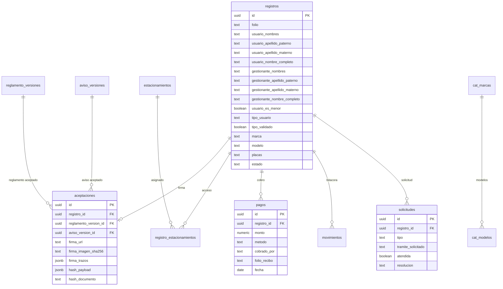

# Modelo de Datos - SATAG

> **Desarrollo - Fase 1 (Diseno)** - WBS 1.2.1 - Entregable **E1**.
> **Ultima actualizacion:** 20-jul-2026.
> **Version:** v0.13 - alineada con el esquema aplicado en produccion.
> **SQL canonico:** [`../supabase/sql/`](../supabase/sql/README.md) (bloques atomicos `00`->`41`).
> `../supabase/schema.sql` es un respaldo historico atrasado: **no** contiene la capa del panel
> (roles finos, RPCs, folios de recibo, CC-01 ni SC-003).

Este documento define el modelo de datos de SATAG: expediente del TAG, vehiculo, firma reforzada, aviso/reglamento versionados, pagos administrativos con folio de recibo, solicitudes de actualizacion/baja, buzon de notas sin folio y controles de privacidad.

## 1. Estado de alineacion E1 + E6

El modelo soporta lo decidido o requerido por E6 (todo lo siguiente esta **aplicado en produccion**):

- Aviso de privacidad versionado.
- Aceptacion ligada a version de aviso y version de reglamento.
- Firma simple reforzada: imagen, trazos opcionales, firmante, rol, hash SHA-256 generado por la base y sello de tiempo.
- Menores: usuario menor requiere gestionante padre/madre/tutor.
- Solicitudes publicas de `actualizacion` y `baja`, mas el buzon de notas sin folio (`nota`, SC-003).
- Bloqueo de expediente previo a supresion.
- Pago administrativo de $100 en efectivo **con folio de recibo automatico** (`SATAG-AAAA-######`), unico por expediente. El corte de caja sigue pendiente.
- Supabase/RLS: lectura publica solo de catalogos y documentos vigentes; PII protegida. El panel exige `aal2` (MFA) + rol fino y toda escritura pasa por RPC `SECURITY DEFINER`.

## 2. Hallazgos base del Excel

| Hallazgo | Implicacion en el modelo |
|---|---|
| No. de TAG venia como numero y se corrompia en Excel | `no_dispositivo` se guarda como `text` con `CHECK` de 6 a 11 digitos. |
| Hay numeros de TAG reutilizados | Unicidad parcial solo para TAG activo. |
| Placas faltantes o duplicadas | Placas requeridas en flujo nuevo salvo `sin_placas`; no son unicas. |
| Gestionante y usuario coinciden casi siempre | Persona denormalizada en `registros`; `gestionante_nombres = NULL` significa mismo usuario. |
| Tipo de usuario venia vacio en muchos casos | `tipo_usuario` obligatorio y `tipo_validado` por Administracion. |
| Marca/color/modelo venian sucios | Catalogos de sugerencia: `cat_marcas`, `cat_modelos`, `cat_colores`. |
| Bajas estaban en notas o sin estructura | `estado`, `motivo_baja`, `fecha_baja` y `movimientos`. |
| Tag propio existe como caso real | `procedencia_tag = propio`; se cobra igual y puede apartarse TAG de escuela. |
| No habia pago ni firma en Excel | `pagos`, `aceptaciones`, `reglamento_versiones`, `aviso_versiones`. |
| Cambio/baja se vuelve autoservicio | `solicitudes` + RPC `crear_solicitud`. |

## 3. Decisiones de diseno vigentes

| # | Decision | Resultado |
|---|---|---|
| 1 | Persona/gestionante | Se guardan en `registros`, no en tabla separada. |
| 2 | Estacionamientos | Puente `registro_estacionamientos` para E1, E2 o ambos. |
| 3 | Tipo de usuario | `tipo_usuario` obligatorio; Administracion valida con `tipo_validado`. |
| 4 | Vehiculo | Marca, modelo, color y placas viven en `registros`; modelo es obligatorio. |
| 5 | Menores | `usuario_es_menor = true` exige gestionante padre/madre/tutor. |
| 6 | Firma | `aceptaciones` guarda reglamento, aviso, firma, trazos, hash generado en BD, paquete firmado y timestamp. |
| 7 | Aviso | `aviso_versiones` conserva versiones del aviso de privacidad SATAG. |
| 8 | Pago | `pagos` registra monto/metodo/cobrado_por/fecha y `folio_recibo` automatico, inmutable y unico; un solo pago por expediente. El corte de caja queda pendiente. |
| 9 | Cambio/baja | `solicitudes` cubre `actualizacion`, `baja` y `nota` (buzon SC-003). No existen tipos ARCO ni revocacion en el esquema; ARCO se atiende por procedimiento sobre esos flujos. |
| 10 | Bloqueo | `registros.estado = bloqueado` conserva evidencia sin uso operativo ordinario. |
| 11 | NOM-151 | Fuera del MVP; hash interno + versionado + sello de tiempo. |

## 4. Tablas del modelo

| Tabla | Proposito | Datos personales |
|---|---|---|
| `registros` | Expediente central: usuario, gestionante, vehiculo, TAG, estado y privacidad | Si |
| `registro_estacionamientos` | Accesos E1/E2 asignados al registro | Indirecto por FK |
| `estacionamientos` | Catalogo E1/E2 | No |
| `cat_marcas` | Catalogo de marcas | No |
| `cat_modelos` | Modelos dependientes de marca | No |
| `cat_colores` | Catalogo de colores | No |
| `reglamento_versiones` | Texto versionado del reglamento | No |
| `aviso_versiones` | Texto versionado del aviso de privacidad | No |
| `aceptaciones` | Evidencia de firma y aceptacion | Si |
| `pagos` | Registro administrativo del cobro, con folio de recibo automatico | Posible |
| `movimientos` | Bitacora de alta, baja, reposicion, cambio, prueba, bloqueo y rectificacion | Posible |
| `solicitudes` | Solicitudes de `actualizacion`/`baja` y notas del buzon sin folio (`nota`, SC-003) | Si |
| `error_logs` | Soporte tecnico - **no implementado** en el esquema aplicado (solo existe en el respaldo `schema.sql`) | Evitar PII |

## 5. Relaciones principales

> En `solicitudes`, `registro_id` es **opcional**: una nota del buzon (SC-003) nace sin expediente y TI la vincula despues.

## 6. `registros`: expediente central

Campos clave:

- Folio: `folio` (`SATAG-######`, unico). Lo asigna el RPC `crear_registro` con la secuencia `registros_folio_seq`; no es DEFAULT de la tabla. El RPC devuelve `{id, folio, estado}` porque `anon` no puede leer `registros`.
- Persona titular: `usuario_nombres`, `usuario_apellido_paterno`, `usuario_apellido_materno` (opcional) y `usuario_nombre_completo` (columna `GENERATED STORED` para busqueda/visualizacion).
- Gestionante: `gestionante_nombres`, `gestionante_apellido_paterno`, `gestionante_apellido_materno`, `gestionante_nombre_completo` (`GENERATED STORED`) y `gestionante_relacion`. `gestionante_nombres = NULL` significa mismo que el usuario.
- Menor: `usuario_es_menor`.
- Clasificacion: `tipo_usuario`, `tipo_validado`, `tipo_validado_por`, `tipo_validado_en`.
- Vehiculo: `marca`, `modelo`, `color`, `placas`, `sin_placas`.
- TAG: `no_dispositivo`, `procedencia_tag`, `tag_apartado`, `tag_apartado_no`.
- Ciclo de vida: `estado`, `motivo_baja`, `fecha_baja`, `fecha_adquisicion`, `fecha_instalacion`, `instalado_por`.
- Privacidad/conservacion: `bloqueado_en`, `bloqueo_motivo`, `suprimir_despues_de`.

Estados vigentes:

- `pendiente`: alta capturada, falta proceso administrativo/TI.
- `activo`: TAG operativo.
- `baja`: TAG dado de baja.
- `bloqueado`: expediente bloqueado por cancelacion/ARCO/conservacion; no debe usarse en operacion ordinaria.

## 7. `aceptaciones`: firma reforzada

Cada registro nuevo debe tener una aceptacion con:

- `reglamento_version_id`
- `aviso_version_id`
- `firma_url` en bucket privado
- `firma_imagen_sha256` opcional para verificar integridad del PNG subido
- `firma_trazos` JSON opcional
- `firmante_nombre`
- `firmante_rol`: `usuario`, `padre`, `madre`, `tutor`, `otro`
- `acepto_reglamento` y `acepto_privacidad`, siempre verdaderos si se crea la aceptacion
- `ip_origen`, `user_agent` y `metadata`, cuando el flujo los pueda obtener de forma confiable
- `hash_payload`: paquete canonico firmado
- `hash_documento`: SHA-256 hexadecimal de 64 caracteres calculado por la base sobre `hash_payload`
- `sello_tiempo` generado por la base

La firma no depende solo de la imagen; la evidencia es el paquete completo.

## 8. `solicitudes`: actualizacion, baja y notas del buzon

Tipos vigentes (`sol_tipo_valido`):

- `actualizacion` - el titular pide corregir o actualizar datos.
- `baja` - el titular pide dar de baja el TAG.
- `nota` - nota del buzon publico sin folio ni placa (SC-003).

**No existe una columna `estado` ni una maquina de cinco estados.** El cierre se modela con dos campos:

- `atendida` (boolean): si TI ya la proceso.
- `resolucion`: `ejecutada` o `descartada`; nula mientras la solicitud siga abierta.

Reglas:

- Maximo una solicitud pendiente por tipo y expediente.
- `registro_id` es **opcional**: una nota nace sin expediente y TI la vincula despues.
- Columnas propias de la nota: `solicitante_nombre`, `solicitante_rol` (`maestro`/`padres`/`alumno`/`admin`), `tramite_solicitado` (`actualizacion` | `baja`), `alumno_nombre`, `alumno_grado`, `vehiculo_desc` y `detalle`. Alumno y grado solo son obligatorios cuando el rol es `padres`.
- Instalar **no** es un tramite de solicitud: el TAG se instala unicamente por el alta (bloque 41).

Entradas publicas (RPC `SECURITY DEFINER`, sin exponer el expediente):

- `crear_solicitud`: requiere folio + placas (o No. de TAG); responde de forma honesta sin revelar datos.
- `crear_nota_solicitud`: buzon sin folio ni placa; no hace busqueda ni confirma si la persona existe.

Cierre por TI: `vincular_nota` (empata la nota con el expediente y **corrobora** el tramite pedido, pudiendo cambiarlo), `descartar_solicitud`, y el auto-cierre de la nota cuando se ejecuta el tramite que coincide.

ARCO no tiene tipos propios en el esquema: se atiende por procedimiento apoyandose en estos flujos y en el estado `bloqueado`.

## 9. Pago administrativo

`pagos` registra:

- `monto`
- `metodo = efectivo`
- `cobrado_por`
- `fecha`
- `folio_recibo`: **automatico, obligatorio e inmutable**, formato `SATAG-AAAA-000001`, generado por la secuencia `pagos_folio_recibo_seq` dentro de PostgreSQL (bloque 32). La secuencia garantiza unicidad aunque dos personas cobren al mismo tiempo.

Reglas:

- **Un solo pago por expediente** (`uq_pagos_registro`): un reintento o un doble clic choca contra el indice en vez de duplicar el cobro, y `registrar_pago` responde con el folio ya emitido.
- El pago se escribe unicamente por el RPC `registrar_pago` (rol `admin`).
- El **corte de caja aun no se modela**: sera una tabla de cortes mas el sello del corte en cada pago. Es la siguiente feature.

## 10. RLS y acceso

Regla base:

- `anon` lee solo catalogos, reglamento vigente y aviso vigente.
- `anon` no lee PII.
- `anon` crea registros, solicitudes y notas solo por RPC `SECURITY DEFINER`.
- El personal del panel se distingue por **roles finos** en `app_metadata.rol`: `admin`, `ti`, `consulta` y `super`. La RLS exige sesion **`aal2` (MFA) mas rol**, y toda escritura pasa por un RPC `SECURITY DEFINER` que revalida el rol con `panel_exigir_rol`. Una sesion `authenticated` sin rol no lee nada del expediente.

Tablas con PII protegida:

- `registros`
- `aceptaciones` (lectura solo `admin`/`super`: es evidencia legal de firma)
- `pagos`
- `movimientos`
- `solicitudes`

## 11. RPCs

### `crear_registro`

Alta publica atomica:

1. Resuelve reglamento vigente.
2. Resuelve aviso vigente.
3. Valida campos obligatorios.
4. Valida menor con gestionante padre/madre/tutor.
5. Asigna `folio` (`SATAG-######`) con `nextval('registros_folio_seq')`.
6. Inserta `registros`.
7. Construye `hash_payload` con reglamento, aviso, datos minimos del registro, firmante, firma y sello de tiempo.
8. Calcula `hash_documento` en PostgreSQL con `pgcrypto`.
9. Inserta `aceptaciones`.
10. Inserta movimiento `alta`.
11. Devuelve `jsonb {id, folio, estado}` (anon no puede leer `registros`).

### `crear_solicitud`

Crea una solicitud publica de `actualizacion` o `baja` a partir de folio + placas (o No. de TAG), sin exponer el expediente completo.

### `crear_nota_solicitud`

Buzon publico sin folio ni placa (SC-003): registra la nota con el solicitante, su rol y el tramite que pide. No hace busqueda ni confirma si la persona existe.

### RPCs del panel (`SECURITY DEFINER` + guardia `panel_exigir_rol`)

| RPC | Rol | Que hace |
|---|---|---|
| `registrar_pago` | `admin` | Cobra el TAG y emite el folio de recibo. |
| `asignar_estacionamiento` | `ti` | Asigna E1/E2 al registro. |
| `instalar_tag_con_estacionamiento` | `ti` | Instala el TAG y asigna estacionamiento en una sola transaccion; pasa el registro a `activo`. |
| `actualizar_registro_con_estacionamiento` | `ti` | Actualiza el expediente y cierra la solicitud/nota cuyo tramite coincide. |
| `dar_baja` | `ti` | Da de baja el TAG y cierra la solicitud/nota de baja. |
| `usar_tag_apartado` | `ti` | Activa como reposicion el TAG que la escuela habia apartado (CC-01). |
| `vincular_nota` | `ti` | Empata una nota del buzon con su expediente y **corrobora** el tramite pedido. |
| `descartar_solicitud` | `ti` | Cierra una solicitud o nota sin ejecutarla, con motivo. |

Los RPC internos `instalar_tag` y `actualizar_registro` quedaron **revocados al cliente** en el bloque 31: el panel llama unicamente a los wrappers `*_con_estacionamiento`, para que el cambio ocurra en una sola transaccion.

## 12. Datos personales para aviso

- `registros.usuario_nombres`
- `registros.usuario_apellido_paterno`
- `registros.usuario_apellido_materno`
- `registros.usuario_nombre_completo`
- `registros.gestionante_nombres`
- `registros.gestionante_apellido_paterno`
- `registros.gestionante_apellido_materno`
- `registros.gestionante_nombre_completo`
- `registros.gestionante_relacion`
- `registros.usuario_es_menor`
- `registros.placas`
- `registros.observaciones`
- `aceptaciones.firma_url`
- `aceptaciones.firma_imagen_sha256`
- `aceptaciones.firma_trazos`
- `aceptaciones.firmante_nombre`
- `aceptaciones.ip_origen`
- `aceptaciones.user_agent`
- `solicitudes.solicitante_nombre`
- `solicitudes.solicitante_rol`
- `solicitudes.alumno_nombre`
- `solicitudes.alumno_grado`
- `solicitudes.vehiculo_desc`
- `solicitudes.detalle`

> **Nota de privacidad:** el buzon publico (`crear_nota_solicitud`) admite que un tercero capture datos
> de otra persona —incluido `alumno_nombre`, que puede ser un menor— **sin verificar identidad**. Es una
> entrada de PII sin sesion que debe estar cubierta por el aviso y considerarse en el modelo de amenaza.
> `pagos.cobrado_por` es PII indirecta del personal, no del titular.

## 13. Pendientes

Ya cerrado: reglamento oficial de 22 clausulas publicado (bloque 23), texto integral del aviso publicado (bloque 22), roles finos de Administracion y TI separados (bloques 27-30) y RLS probada con `anon` y con usuarios reales del panel.

Abierto:

- Aprobacion institucional del aviso de privacidad y su URL definitiva.
- Confirmar responsable ARCO.
- Confirmar plazo de conservacion/bloqueo/supresion.
- Confirmar DPA y region de Supabase.
- Modelar el **corte de caja**: tabla de cortes mas el sello del corte en `pagos` (siguiente feature).
- Vista `v_registros_incompletos` (B2): documentada desde el 03-jul, aun no implementada.

## 14. Archivos relacionados

- [`../supabase/sql/README.md`](../supabase/sql/README.md) - runbook de los bloques aplicados (**fuente de verdad**)
- [`../supabase/sql/AUDITORIA.md`](../supabase/sql/AUDITORIA.md) - auditoria tabla por tabla
- [`../supabase/README.md`](../supabase/README.md)
- [`../supabase/schema.sql`](../supabase/schema.sql) - respaldo historico atrasado; no instalar con el
- [`04 - Seguridad, RLS y Privacidad.md`](04%20-%20Seguridad%2C%20RLS%20y%20Privacidad.md)
- [`../Entregables/E6 - Cumplimiento Legal y Privacidad/E6 - Decisiones Legales Pendientes.md`](../Entregables/E6%20-%20Cumplimiento%20Legal%20y%20Privacidad/E6%20-%20Decisiones%20Legales%20Pendientes.md)
