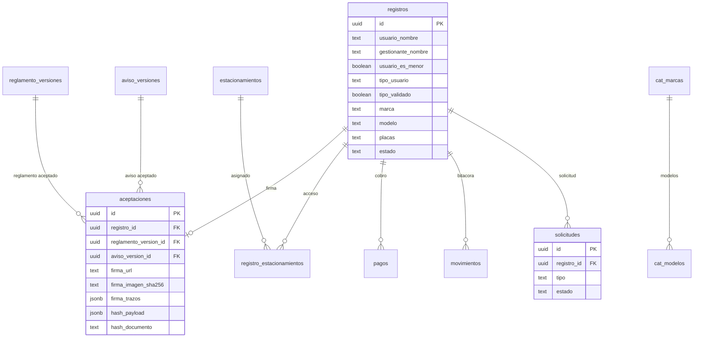

# Modelo de Datos - SATAV

> **Desarrollo - Fase 1 (Diseno)** - WBS 1.2.1 - Entregable **E1**.
> **Fecha:** 06-jul-2026.
> **Version:** v0.12 - alineada con E6 legal/privacidad.
> **SQL canonico:** [`../supabase/schema.sql`](../supabase/schema.sql).

Este documento define el modelo de datos de SATAV para el MVP: expediente del TAG, vehiculo, firma reforzada, aviso/reglamento versionados, pagos administrativos, solicitudes de cambio/baja/ARCO y controles de privacidad.

## 1. Estado de alineacion E1 + E6

El modelo ya debe soportar lo decidido o requerido por E6:

- Aviso de privacidad versionado.
- Aceptacion ligada a version de aviso y version de reglamento.
- Firma simple reforzada: imagen, trazos opcionales, firmante, rol, hash SHA-256 generado por la base y sello de tiempo.
- Menores: usuario menor requiere gestionante padre/madre/tutor.
- Solicitudes: cambio, baja, ARCO y revocacion.
- Bloqueo de expediente previo a supresion.
- Pago administrativo de $100 en efectivo, sin folio/recibo/corte especifico por ahora.
- Supabase/RLS: lectura publica solo de catalogos y documentos vigentes; PII protegida.

## 2. Hallazgos base del Excel

| Hallazgo | Implicacion en el modelo |
|---|---|
| No. de TAG venia como numero y se corrompia en Excel | `no_dispositivo` se guarda como `text` con `CHECK` de 6 a 11 digitos. |
| Hay numeros de TAG reutilizados | Unicidad parcial solo para TAG activo. |
| Placas faltantes o duplicadas | Placas requeridas en flujo nuevo salvo `sin_placas`; no son unicas. |
| Gestionante y usuario coinciden casi siempre | Persona denormalizada en `registros`; `gestionante_nombre = NULL` significa mismo usuario. |
| Tipo de usuario venia vacio en muchos casos | `tipo_usuario` obligatorio y `tipo_validado` por Administracion. |
| Marca/color/modelo venian sucios | Catalogos de sugerencia: `cat_marcas`, `cat_modelos`, `cat_colores`. |
| Bajas estaban en notas o sin estructura | `estado`, `motivo_baja`, `fecha_baja` y `movimientos`. |
| Tag propio existe como caso real | `procedencia_tag = propio`; se cobra igual y puede apartarse TAG de escuela. |
| No habia pago ni firma en Excel | `pagos`, `aceptaciones`, `reglamento_versiones`, `aviso_versiones`. |
| Cambio/baja se vuelve autoservicio | `solicitudes` + RPC `crear_solicitud`. |

## 3. Decisiones de diseno vigentes

| # | Decision | Resultado |
|---|---|---|
| 1 | Persona/gestionante | Se guardan en `registros`, no en tabla separada. |
| 2 | Estacionamientos | Puente `registro_estacionamientos` para E1, E2 o ambos. |
| 3 | Tipo de usuario | `tipo_usuario` obligatorio; Administracion valida con `tipo_validado`. |
| 4 | Vehiculo | Marca, modelo, color y placas viven en `registros`; modelo es obligatorio. |
| 5 | Menores | `usuario_es_menor = true` exige gestionante padre/madre/tutor. |
| 6 | Firma | `aceptaciones` guarda reglamento, aviso, firma, trazos, hash generado en BD, paquete firmado y timestamp. |
| 7 | Aviso | `aviso_versiones` conserva versiones del aviso de privacidad SATAV. |
| 8 | Pago | `pagos` registra monto/metodo/cobrado_por/fecha; sin folio/recibo/corte por ahora. |
| 9 | Cambio/baja/ARCO | `solicitudes` cubre cambio, baja, ARCO y revocacion. |
| 10 | Bloqueo | `registros.estado = bloqueado` conserva evidencia sin uso operativo ordinario. |
| 11 | NOM-151 | Fuera del MVP; hash interno + versionado + sello de tiempo. |

## 4. Tablas del modelo

| Tabla | Proposito | Datos personales |
|---|---|---|
| `registros` | Expediente central: usuario, gestionante, vehiculo, TAG, estado y privacidad | Si |
| `registro_estacionamientos` | Accesos E1/E2 asignados al registro | Indirecto por FK |
| `estacionamientos` | Catalogo E1/E2 | No |
| `cat_marcas` | Catalogo de marcas | No |
| `cat_modelos` | Modelos dependientes de marca | No |
| `cat_colores` | Catalogo de colores | No |
| `reglamento_versiones` | Texto versionado del reglamento | No |
| `aviso_versiones` | Texto versionado del aviso de privacidad | No |
| `aceptaciones` | Evidencia de firma y aceptacion | Si |
| `pagos` | Registro administrativo del cobro | Posible |
| `movimientos` | Bitacora de alta, baja, cambio, prueba, bloqueo y rectificacion | Posible |
| `solicitudes` | Cambio, baja, ARCO y revocacion | Si |
| `error_logs` | Soporte tecnico | Evitar PII |

## 5. Relaciones principales

## 6. `registros`: expediente central

Campos clave:

- Persona: `usuario_nombre`, `gestionante_nombre`, `gestionante_relacion`, `usuario_es_menor`.
- Clasificacion: `tipo_usuario`, `tipo_validado`, `tipo_validado_por`, `tipo_validado_en`.
- Vehiculo: `marca`, `modelo`, `color`, `placas`, `sin_placas`.
- TAG: `no_dispositivo`, `procedencia_tag`, `tag_apartado`, `tag_apartado_no`.
- Ciclo de vida: `estado`, `motivo_baja`, `fecha_baja`.
- Privacidad/conservacion: `bloqueado_en`, `bloqueo_motivo`, `suprimir_despues_de`.

Estados vigentes:

- `pendiente`: alta capturada, falta proceso administrativo/TI.
- `activo`: TAG operativo.
- `baja`: TAG dado de baja.
- `bloqueado`: expediente bloqueado por cancelacion/ARCO/conservacion; no debe usarse en operacion ordinaria.

## 7. `aceptaciones`: firma reforzada

Cada registro nuevo debe tener una aceptacion con:

- `reglamento_version_id`
- `aviso_version_id`
- `firma_url` en bucket privado
- `firma_imagen_sha256` opcional para verificar integridad del PNG subido
- `firma_trazos` JSON opcional
- `firmante_nombre`
- `firmante_rol`: `usuario`, `padre`, `madre`, `tutor`, `otro`
- `acepto_reglamento` y `acepto_privacidad`, siempre verdaderos si se crea la aceptacion
- `ip_origen`, `user_agent` y `metadata`, cuando el flujo los pueda obtener de forma confiable
- `hash_payload`: paquete canonico firmado
- `hash_documento`: SHA-256 hexadecimal de 64 caracteres calculado por la base sobre `hash_payload`
- `sello_tiempo` generado por la base

La firma no depende solo de la imagen; la evidencia es el paquete completo.

## 8. `solicitudes`: cambio, baja y ARCO

Tipos:

- `cambio`
- `baja`
- `arco_acceso`
- `arco_rectificacion`
- `arco_cancelacion`
- `arco_oposicion`
- `revocacion`

Estados:

- `pendiente`
- `en_revision`
- `atendida`
- `rechazada`
- `cancelada`

Estas solicitudes se crean por RPC publica controlada (`crear_solicitud`) y solo las lee personal autorizado.

## 9. Pago administrativo

El pago queda reducido al MVP decidido:

- `monto`
- `metodo = efectivo`
- `cobrado_por`
- `fecha`

No se modela folio, recibo ni corte de caja por ahora. Si Administracion lo pide despues, se agregara como cambio de alcance.

## 10. RLS y acceso

Regla base:

- `anon` lee solo catalogos, reglamento vigente y aviso vigente.
- `anon` no lee PII.
- `anon` crea registros y solicitudes solo por RPC `SECURITY DEFINER`.
- `authenticated` representa personal interno por ahora; queda pendiente separar roles finos de Administracion y TI.

Tablas con PII protegida:

- `registros`
- `aceptaciones`
- `pagos`
- `movimientos`
- `solicitudes`

## 11. RPCs

### `crear_registro`

Alta publica atomica:

1. Resuelve reglamento vigente.
2. Resuelve aviso vigente.
3. Valida campos obligatorios.
4. Valida menor con gestionante padre/madre/tutor.
5. Inserta `registros`.
6. Construye `hash_payload` con reglamento, aviso, datos minimos del registro, firmante, firma y sello de tiempo.
7. Calcula `hash_documento` en PostgreSQL con `pgcrypto`.
8. Inserta `aceptaciones`.
9. Inserta movimiento `alta`.

### `crear_solicitud`

Crea solicitud publica de cambio, baja, ARCO o revocacion sin exponer el expediente completo.

## 12. Datos personales para aviso

- `registros.usuario_nombre`
- `registros.gestionante_nombre`
- `registros.gestionante_relacion`
- `registros.usuario_es_menor`
- `registros.placas`
- `registros.observaciones`
- `aceptaciones.firma_url`
- `aceptaciones.firma_imagen_sha256`
- `aceptaciones.firma_trazos`
- `aceptaciones.firmante_nombre`
- `aceptaciones.ip_origen`
- `aceptaciones.user_agent`
- `solicitudes.solicitante_nombre`
- `solicitudes.contacto`
- `solicitudes.detalle`

## 13. Pendientes antes de Supabase real

- Sustituir reglamento placeholder por texto oficial.
- Sustituir aviso placeholder por texto aprobado.
- Confirmar responsable ARCO.
- Confirmar plazo de conservacion/bloqueo/supresion.
- Confirmar DPA y region de Supabase.
- Separar roles de Administracion y TI.
- Probar RLS con `anon` y usuarios `authenticated`.

## 14. Archivos relacionados

- [`../supabase/schema.sql`](../supabase/schema.sql)
- [`../supabase/seed.sql`](../supabase/seed.sql)
- [`../supabase/README.md`](../supabase/README.md)
- [`04 - Seguridad, RLS y Privacidad.md`](04%20-%20Seguridad%2C%20RLS%20y%20Privacidad.md)
- [`../Entregables/E6 - Cumplimiento Legal y Privacidad/E6 - Decisiones Legales Pendientes.md`](../Entregables/E6%20-%20Cumplimiento%20Legal%20y%20Privacidad/E6%20-%20Decisiones%20Legales%20Pendientes.md)
