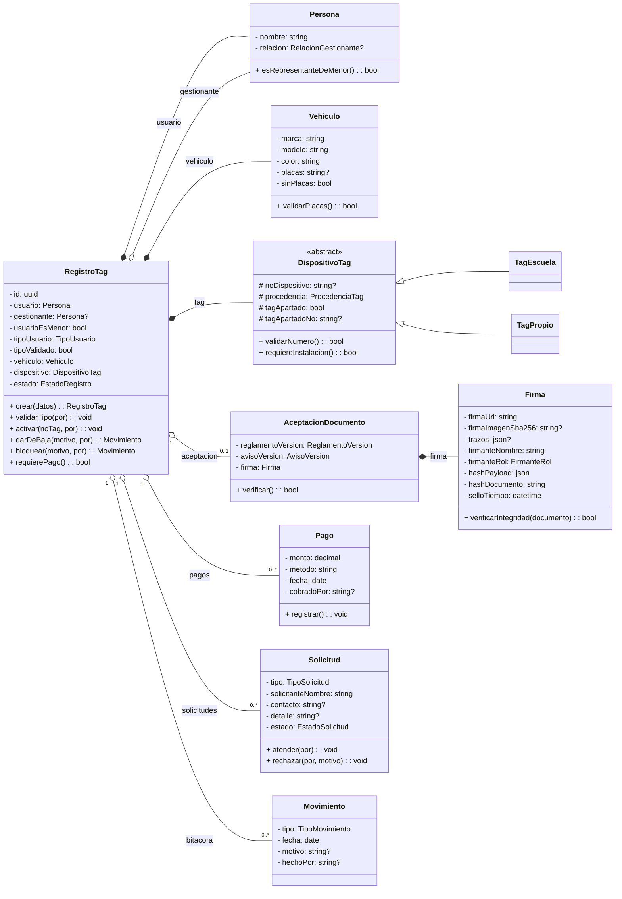

# Modelo de Dominio POO - SATAG

> **Desarrollo - Fase 1 (Diseno)**.
> **Fecha:** 06-jul-2026.
> **Version:** v0.6 - alineada con E1/E6.

Este documento describe las clases de dominio que consumen el modelo relacional de [`01 - Modelo de Datos y Base de Datos.md`](01%20-%20Modelo%20de%20Datos%20y%20Base%20de%20Datos.md). La persistencia canonica vive en `supabase/schema.sql`.

## 1. Principio de diseno

SATAG puede usar objetos de dominio sin abandonar Supabase/PostgreSQL:

- El objeto valida reglas y expresa comportamiento.
- El repositorio persiste y reconstruye objetos.
- Las RPC publicas (`crear_registro`, `crear_solicitud`) protegen escrituras anonimas.
- RLS protege la lectura de datos personales.

## 2. Clases principales

## 3. Reglas de dominio alineadas

| Regla | Comportamiento |
|---|---|
| Menor de edad | `RegistroTag.crear` exige gestionante con relacion `padre`, `madre` o `tutor`. |
| Firma | `AceptacionDocumento` junta reglamento, aviso y `Firma`; no se valida solo por imagen. |
| Pago | `Pago` es simple: monto, efectivo, fecha y cobrado por. No hay folio, recibo ni corte en MVP. |
| Tag propio | Se cobra igual que escuela y puede apartar TAG fisico para reposicion. |
| Bloqueo ARCO | `RegistroTag.bloquear` cambia a estado `bloqueado` y genera movimiento. |
| Solicitudes | Incluyen cambio, baja, ARCO y revocacion. |

## 4. Mapeo clase-tabla

| Clase | Tabla/columnas |
|---|---|
| `RegistroTag` | `registros` |
| `Persona` | `registros.usuario_nombre`, `gestionante_nombre`, `gestionante_relacion`, `usuario_es_menor` |
| `Vehiculo` | `registros.marca`, `modelo`, `color`, `placas`, `sin_placas` |
| `DispositivoTag` | `registros.no_dispositivo`, `procedencia_tag`, `tag_apartado`, `tag_apartado_no` |
| `AceptacionDocumento` | `aceptaciones` + `reglamento_versiones` + `aviso_versiones` |
| `Firma` | `aceptaciones.firma_url`, `firma_imagen_sha256`, `firma_trazos`, `hash_payload`, `hash_documento`, `sello_tiempo` |
| `Pago` | `pagos` |
| `Solicitud` | `solicitudes` |
| `Movimiento` | `movimientos` |

## 5. Servicios sugeridos

| Servicio | Responsabilidad |
|---|---|
| `RegistroTagService` | Alta, activacion, baja, bloqueo, reposicion y validacion de tipo. |
| `FirmaService` | Capturar firma, subir a Storage, calcular hash del PNG si aplica y pedir a la RPC que genere el hash legal de aceptacion. |
| `DocumentoVersionadoService` | Obtener reglamento/aviso vigente y reconstruir texto firmado. |
| `PagoService` | Registrar cobro simple en efectivo. |
| `SolicitudService` | Crear, atender o rechazar solicitudes. |
| `CatalogoService` | Marcas, modelos, colores y estacionamientos. |

## 6. Enums

| Enum | Valores |
|---|---|
| `TipoUsuario` | `maestro`, `padres`, `alumno`, `admin` |
| `RelacionGestionante` | `padre`, `madre`, `tutor`, `otro` |
| `EstadoRegistro` | `pendiente`, `activo`, `baja`, `bloqueado` |
| `ProcedenciaTag` | `escuela`, `propio` |
| `FirmanteRol` | `usuario`, `padre`, `madre`, `tutor`, `otro` |
| `TipoMovimiento` | `alta`, `baja`, `reposicion`, `cambio`, `prueba`, `bloqueo`, `rectificacion` |
| `TipoSolicitud` | `cambio`, `baja`, `arco_acceso`, `arco_rectificacion`, `arco_cancelacion`, `arco_oposicion`, `revocacion` |
| `EstadoSolicitud` | `pendiente`, `en_revision`, `atendida`, `rechazada`, `cancelada` |

## 7. Diferido

`CorteCaja` / POS queda fuera del MVP actual. Se agregara solo si Administracion solicita folio, recibo, corte o cuadre formal de caja.
