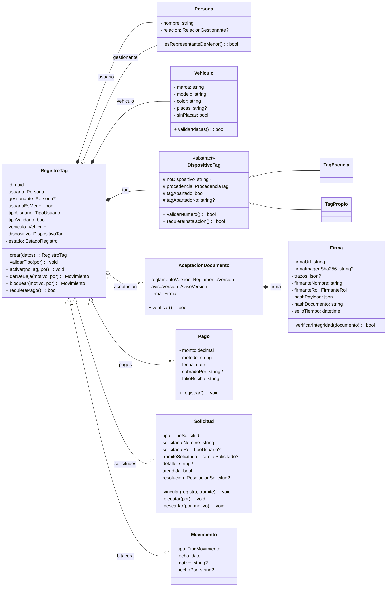

# Modelo de Dominio POO - SATAG

> **Desarrollo - Fase 1 (Diseno)**.
> **Ultima actualizacion:** 20-jul-2026.
> **Version:** v0.7 - alineada con el esquema aplicado en produccion.

Este documento describe las clases de dominio que consumen el modelo relacional de [`01 - Modelo de Datos y Base de Datos.md`](01%20-%20Modelo%20de%20Datos%20y%20Base%20de%20Datos.md). La persistencia canonica vive en los bloques atomicos [`supabase/sql/`](../supabase/sql/README.md) (`00`->`41`), no en el respaldo `schema.sql`.

## 1. Principio de diseno

SATAG puede usar objetos de dominio sin abandonar Supabase/PostgreSQL:

- El objeto valida reglas y expresa comportamiento.
- El repositorio persiste y reconstruye objetos.
- Las RPC publicas (`crear_registro`, `crear_solicitud`) protegen escrituras anonimas.
- RLS protege la lectura de datos personales.

## 2. Clases principales

## 3. Reglas de dominio alineadas

| Regla | Comportamiento |
|---|---|
| Menor de edad | `RegistroTag.crear` exige gestionante con relacion `padre`, `madre` o `tutor`. |
| Firma | `AceptacionDocumento` junta reglamento, aviso y `Firma`; no se valida solo por imagen. |
| Pago | `Pago` lleva monto, efectivo, fecha, cobrado por y **`folioRecibo` automatico e inmutable**; uno solo por expediente. El corte de caja aun no se modela. |
| Tag propio | Se cobra igual que el de escuela y **aparta** el TAG de la escuela para una reposicion futura (`usarTagApartado`). |
| Bloqueo ARCO | `RegistroTag.bloquear` cambia a estado `bloqueado` y genera movimiento. |
| Solicitudes | Son `actualizacion`, `baja` o `nota` (buzon sin folio). No existen tipos ARCO ni revocacion en el esquema. |
| Nota del buzon | Nace **sin expediente**; TI la vincula y **corrobora** el tramite pedido (puede cambiarlo). Se cierra sola cuando se ejecuta el tramite que coincide. |

## 4. Mapeo clase-tabla

| Clase | Tabla/columnas |
|---|---|
| `RegistroTag` | `registros` |
| `Persona` | `registros.usuario_nombres` + `usuario_apellido_paterno`/`usuario_apellido_materno` (con `usuario_nombre_completo` GENERATED), `gestionante_nombres` + apellidos (con `gestionante_nombre_completo`), `gestionante_relacion`, `usuario_es_menor` |
| `Vehiculo` | `registros.marca`, `modelo`, `color`, `placas`, `sin_placas` |
| `DispositivoTag` | `registros.no_dispositivo`, `procedencia_tag`, `tag_apartado`, `tag_apartado_no` |
| `AceptacionDocumento` | `aceptaciones` + `reglamento_versiones` + `aviso_versiones` |
| `Firma` | `aceptaciones.firma_url`, `firma_imagen_sha256`, `firma_trazos`, `hash_payload`, `hash_documento`, `sello_tiempo` |
| `Pago` | `pagos` |
| `Solicitud` | `solicitudes` |
| `Movimiento` | `movimientos` |

## 5. Servicios sugeridos

| Servicio | Responsabilidad |
|---|---|
| `RegistroTagService` | Alta, activacion, baja, bloqueo, reposicion y validacion de tipo. |
| `FirmaService` | Capturar firma, subir a Storage, calcular hash del PNG si aplica y pedir a la RPC que genere el hash legal de aceptacion. |
| `DocumentoVersionadoService` | Obtener reglamento/aviso vigente y reconstruir texto firmado. |
| `PagoService` | Registrar el cobro en efectivo; el folio de recibo lo emite la base al insertar. |
| `SolicitudService` | Crear solicitudes y notas del buzon, vincularlas al expediente, ejecutarlas o descartarlas. |
| `CatalogoService` | Marcas, modelos, colores y estacionamientos. |

## 6. Enums

| Enum | Valores |
|---|---|
| `TipoUsuario` | `maestro`, `padres`, `alumno`, `admin` |
| `RelacionGestionante` | `padre`, `madre`, `tutor`, `otro` |
| `EstadoRegistro` | `pendiente`, `activo`, `baja`, `bloqueado` |
| `ProcedenciaTag` | `escuela`, `propio` |
| `FirmanteRol` | `usuario`, `padre`, `madre`, `tutor`, `otro` |
| `TipoMovimiento` | `alta`, `baja`, `reposicion`, `cambio`, `prueba`, `bloqueo`, `rectificacion` |
| `TipoSolicitud` | `actualizacion`, `baja`, `nota` |
| `TramiteSolicitado` | `actualizacion`, `baja` - solo en notas del buzon; instalar no es tramite de solicitud |
| `ResolucionSolicitud` | `ejecutada`, `descartada` - nula mientras la solicitud sigue abierta (el cierre se modela con `atendida` + `resolucion`, no con un enum de estados) |

## 7. Diferido

El **folio de recibo ya no esta diferido**: cada `Pago` lo emite automaticamente (bloque 32).

`CorteCaja` sigue fuera del modelo actual y es la **siguiente feature**: vista de finanzas para Administracion con corte de caja y conciliacion del efectivo contado contra el esperado.
