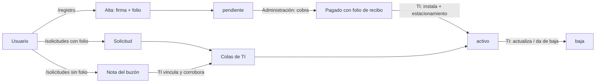

# Flujos del Sistema — SATAG

> **Estado:** implementados y en producción — documento *as-built*.
> **Última actualización:** 20-jul-2026.

Recorridos funcionales por actor. Cada escritura ocurre dentro de un RPC `SECURITY DEFINER` que
revalida el rol; el front nunca escribe directo.

## 1. Panorama

## 2. Autoservicio: alta del TAG (`/registro`)

Actor: el usuario, sin cuenta ni sesión.

1. **Aviso de privacidad** — se muestra el aviso integral; la casilla de aceptación **no** viene
   premarcada y se habilita al leerlo.
2. **Captura** — usuario y vehículo: nombres y apellidos por separado, tipo de usuario
   (`maestro`/`padres`/`alumno`/`admin`), marca → modelo con **dropdown dependiente** y opción "Otro",
   color, placas o `sin placas`.
3. **Menor de edad** — si el usuario es menor, exige gestionante con relación `padre`, `madre` o
   `tutor`; ese gestionante es quien firma.
4. **Reglamento** — las 22 cláusulas oficiales del IAQ, en su versión vigente.
5. **Firma reforzada** — canvas → PNG al bucket privado + trazos vectoriales.
6. **Guardado atómico** — el RPC `crear_registro` resuelve reglamento y aviso vigentes, valida, asigna
   folio `SATAG-######`, e inserta **registro + aceptación + movimiento `alta`** en una transacción.
   Devuelve `{id, folio, estado}` porque `anon` no puede leer `registros`.

Resultado: registro en estado **`pendiente`**. La evidencia de firma guarda versión de reglamento y de
aviso, hash SHA-256 calculado por la base y sello de tiempo.

## 3. Administración: cobro (`/admin`, rol `admin`)

Actor: Administración (cobro en efectivo).

1. Cola **"Registrar pago"**: registros `pendiente` sin pago, ordenados por antigüedad del alta.
2. Se captura el monto (hoy $100) y quién cobra.
3. El RPC `registrar_pago` inserta el pago y **la base emite el folio de recibo**
   (`SATAG-AAAA-######`, automático e inmutable).

Reglas:

- **Un solo pago por expediente**: un doble clic o un reintento choca contra el índice único y
  responde con el folio ya emitido, en vez de duplicar el cobro.
- El TAG **propio también se cobra** (rev. 03-jul).
- Administración **ya no asigna estacionamiento**: eso pasó a TI (SC-002).

Pendiente: **corte de caja / finanzas** (siguiente feature).

## 4. TI: instalación (`/admin`, rol `ti`)

1. Cola **"Instalar TAG"**: registros pendientes de instalar. Los que aún no tienen pago aparecen
   atenuados como *esperando pago*.
2. Con la persona presente, TI asigna **estacionamiento** (E1/E2) y captura el **No. de dispositivo**.
3. El RPC `instalar_tag_con_estacionamiento` hace ambas cosas en una sola transacción y pasa el
   registro a **`activo`**.

**TAG propio (CC-01):** si la familia usa su propio TAG, la escuela le **aparta** el que le tocaba
(`tag_apartado` + `tag_apartado_no`), que queda reservado sin instalar.

## 5. TI: actualizar, baja y reposición

| Flujo | RPC | Efecto |
|---|---|---|
| Actualizar datos | `actualizar_registro_con_estacionamiento` | Actualiza el expediente y cierra la solicitud o nota cuyo trámite coincide. |
| Dar de baja | `dar_baja` | Pasa a `baja`, registra motivo y cierra la solicitud/nota de baja. |
| Usar el TAG apartado | `usar_tag_apartado` | El TAG reservado entra en uso: `no_dispositivo ← tag_apartado_no`, procedencia pasa a `escuela`, se consume la reserva y se registra un movimiento `reposicion`. |

Caso borde cerrado (CC-01): cambiar la procedencia a `escuela` desde "Actualizar" mientras hay un
apartado vivo está **prohibido**; TI debe usar el apartado o quitarlo explícitamente primero.

## 6. Solicitud con folio (`/solicitudes`)

El usuario que **sí** recuerda su folio pide `actualizacion` o `baja` con folio + placas (o No. de
TAG). El RPC `crear_solicitud` responde de forma honesta sin revelar datos del expediente —el folio es
secuencial, no un secreto fuerte— y la solicitud cae en la cola de TI correspondiente.

Máximo una solicitud pendiente por tipo y expediente.

## 7. Buzón de notas sin folio (SC-003, `/solicitudes`)

Para quien **no** recuerda folio ni placa.

1. La persona deja: su nombre, su rol (`maestro`/`padres`/`alumno`/`admin`), el **trámite que pide**
   (`actualizacion` o `baja`), el detalle y, solo si es `padres`, el alumno y su grado.
2. `crear_nota_solicitud` guarda la nota **sin buscar nada**: no confirma si la persona existe ni
   revela información.
3. La nota llega a la cola **"Notas sin expediente"** de TI, con badge de días de espera.
4. TI busca por nombre y usa `vincular_nota`, que empata la nota con el expediente y **corrobora el
   trámite**: si el que pidió el cliente no procede, TI aplica otro y la nota se actualiza.
5. El registro cae en la cola del trámite corroborado. **Al ejecutarlo, la nota se cierra sola** (por
   coincidencia de trámite); si TI ejecuta un trámite distinto, la cierra a mano.

**Instalar no es un trámite de solicitud** (bloque 41): el TAG se instala únicamente por el alta. La
cola "Instalar TAG" mira registros del flujo de alta, no solicitudes.

## 8. Descarte

`descartar_solicitud` cierra una solicitud o nota sin ejecutarla, dejando motivo. Funciona también
sobre notas **sin vincular** (`registro_id` nulo es legítimo).

## 9. Flujos aún no implementados

- **Corte de caja / finanzas** (B3): siguiente feature. Hoy existe el folio de recibo, no el corte.
- **Reporte de registros incompletos** (B2): ni la vista `v_registros_incompletos` ni la bandeja del
  panel existen todavía.

## Referencias

- [`01 - Modelo de Datos y Base de Datos.md`](01%20-%20Modelo%20de%20Datos%20y%20Base%20de%20Datos.md)
- [`02 - Modelo de Dominio POO.md`](02%20-%20Modelo%20de%20Dominio%20POO.md)
- [`../supabase/sql/README.md`](../supabase/sql/README.md) — runbook de los bloques aplicados
