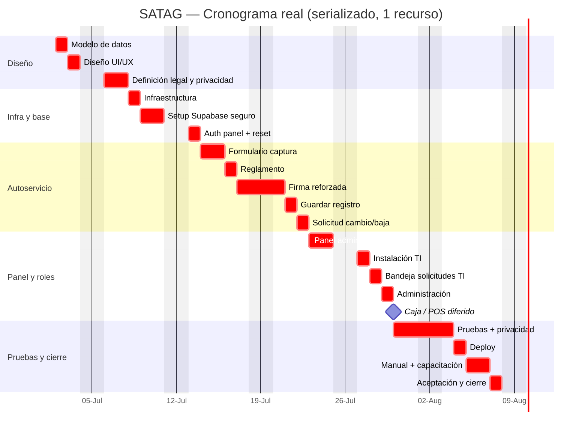
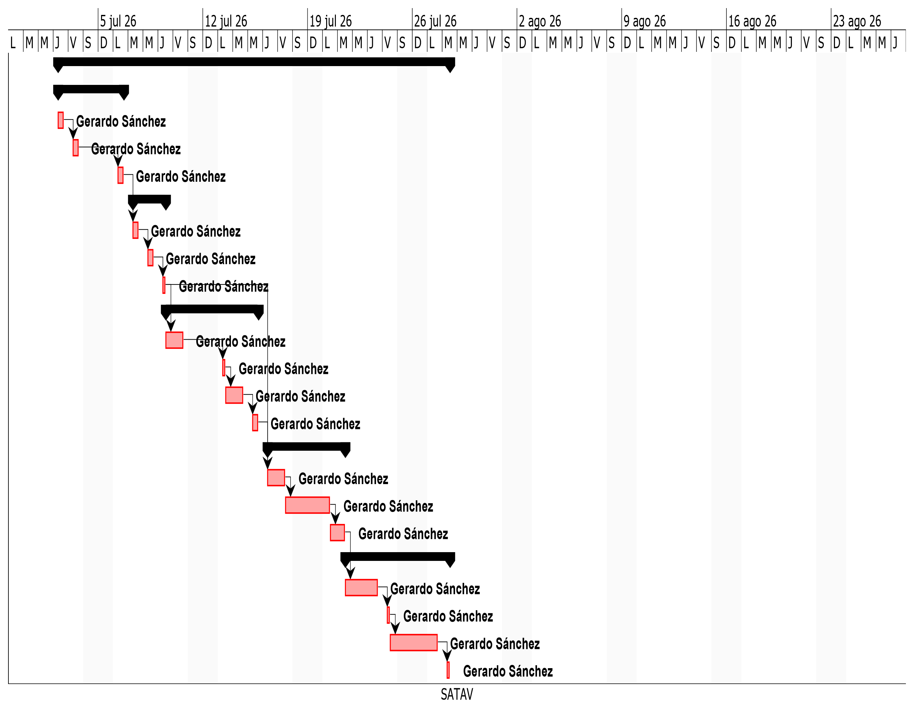
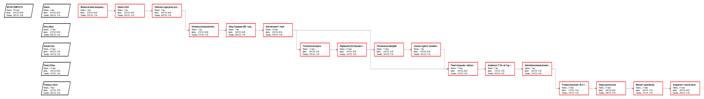
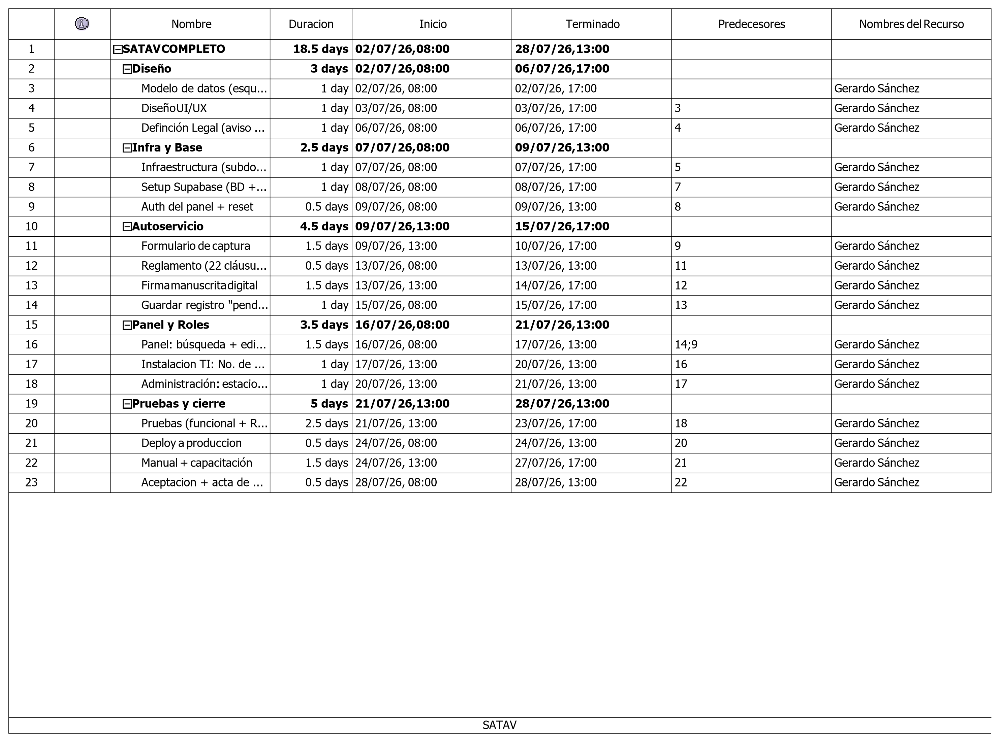

# Doc 2 — Enunciado del Alcance, WBS y Cronograma

> **Plan de Dirección · Fase 2 (Planeación)** · Entregable del cierre (01-jul)
> Documentos del estándar incluidos: **2.1 Enunciado del Alcance + EDT/WBS** + **2.3 Cronograma**
> Se apoya en el Doc 1 (Charter) y en el Playbook técnico (`Investigacion/`).

| Proyecto | **SATAG** — Sistema de Adquisición de TAG Vehicular |
|---|---|
| Cliente | Instituto Asunción de Querétaro AC (IAQ) — interno |
| Responsable / Desarrollador | Gerardo Sánchez — Soporte TI Jr. |
| Fecha | 03-jul-2026 · Versión **v0.3** |

**Historial de versiones:** v0.1 (01-jul, borrador) · v0.2 (01-jul, cronograma completo + diccionario de la WBS + pruebas ampliadas a 2.5 d + vistas de recursos) · **v0.3** (03-jul, opción A de cumplimiento legal: aviso SATAG, firma reforzada, menores, RLS/RPC/MFA y ARCO básico).

---

## 2.1 Enunciado del Alcance

### Descripción del alcance del producto

SATAG es una **aplicación web estática** (Next.js export + Supabase) que reemplaza la hoja física de
adquisición de TAG vehicular del IAQ. Digitaliza el **reglamento (22 cláusulas)**, la **captura de
datos** del usuario y su vehículo, la **aceptación con firma manuscrita digital**, y el **expediente**
de cada TAG a lo largo de su ciclo de vida, más un **panel administrativo** de consulta y control.

El proceso se cubre en **tres momentos / tres actores**:

1. **Usuario (autoservicio):** captura sus datos, vehículo y placas; lee y **firma** el reglamento.
   → registro **"pendiente"**.
2. **Personal administrativo:** asigna el **estacionamiento** (número del estacionamiento de la
   escuela al que tendrá acceso) y **cobra el TAG ($100, solo efectivo)**, registrando el pago.
3. **Departamento de TI:** al **instalar** el TAG captura el **No. de Dispositivo** y marca
   **"instalado"**. Después administra estados (inactivo/repuesto).

### Entregables principales

| # | Entregable | Descripción |
|---|---|---|
| E1 | **Modelo de datos + BD (Supabase)** | Esquema, RLS, RPC de guardado atómico, almacenamiento de la firma |
| E2 | **Formulario de autoservicio** | Reglamento + captura + **firma manuscrita digital** + comprobante |
| E3 | **Módulo de administración** | Asignación de estacionamiento + registro de pago |
| E4 | **Módulo de instalación (TI)** | Captura del No. de TAG + cambio de estado + ciclo de vida |
| E5 | **Panel administrativo** | Login, búsqueda/consulta, edición, control de TAGs/estados/pagos, reporte de pendientes |
| E6 | **Cumplimiento legal y privacidad** | Aviso específico SATAG/anexo, aviso simplificado, ARCO básico, menores y firma reforzada |
| E7 | **Infraestructura y despliegue** | Subdominio GoDaddy + Cloudflare + proyecto Supabase + GitHub Action |
| E8 | **Documentación y manual** | Docs técnicas + manual breve para administrativos/TI |

### Criterios de aceptación

- Todos los campos de la hoja física están cubiertos, **validados** (placa, tipo, No. de TAG) y
  guardados en Supabase.
- El usuario puede **firmar** el reglamento (firma manuscrita digital) y se conserva como evidencia
  (imagen + versión del reglamento + versión del aviso + hash SHA-256 + sello de tiempo + nombre).
- El formulario muestra **aviso simplificado** antes de capturar datos y conserva la versión aceptada.
- Si el usuario del TAG es menor de edad, la aceptación la firma el **padre/madre/tutor** como gestionante.
- Administración puede **asignar estacionamiento** y **registrar el pago** ($100, efectivo).
- TI puede **capturar el No. de TAG** y cambiar el estado (pendiente → instalado → inactivo/repuesto).
- El panel permite **buscar** por nombre/placa/TAG/estacionamiento en **< 5 s** y ver **estado y pago**.
- El panel/proceso permite atender solicitudes básicas **ARCO/cambio/baja** (acceso, rectificación y
  cancelación/bloqueo operativo cuando aplique).
- El sitio corre en el **subdominio** con HTTPS y **deploy automático** por push a `main`.
- La app **no expone** datos de un usuario a otro (RLS verificada); las escrituras críticas usan RPC
  controladas, las firmas viven en Storage privado y las cuentas administrativas usan MFA.

### Exclusiones (lo que NO se hará)

- Integración con **hardware** de acceso (lector RFID/TAG, pluma/barrera) — *documentado como
  evolución futura, no prioritaria* (ver Anexo A, §2.5).
- **Pago en línea** (el cobro es presencial/efectivo; el sistema solo lo **registra**).
- **App móvil nativa** (se cubre con web responsiva).
- **Migración masiva** del histórico en papel.

### Restricciones

- **Web estática** (sin servidor propio): front Next.js `output:"export"`, datos en **Supabase**.
- **Infraestructura fija:** GoDaddy (cPanel/subdominio) + Cloudflare (DNS/proxy) + GitHub Action (FTPS).
- **Firma manuscrita digital** obligatoria (definición del IAQ).
- **Presupuesto:** interno, sin pago extra; gasto out-of-pocket ≈ **$0** (infra ya contratada).
- **Plazo:** meta **24-jul-2026**; **1 desarrollador** (Gerardo).
- **Legal:** manejo de datos personales bajo **LFPDPPP** vigente (aviso específico SATAG, aviso simplificado,
  RLS/RPC, ARCO básico, menores y evidencia de firma). NOM-151 queda como mejora futura/cotización, no como
  requisito del MVP.

### Supuestos

- Se reutiliza la infraestructura probada de SEVAD (mismo GoDaddy/Cloudflare/Supabase-cuenta).
- El auditor (jefe de Sistemas) **valida el mismo día** (misma oficina) → iteraciones rápidas.
- El personal administrativo y de TI están disponibles para definir y probar sus fases.
- El texto de las 22 cláusulas y el catálogo de estacionamientos los provee el IAQ.

---

## 2.2 EDT / WBS (descomposición del trabajo)

```
1. SATAG
├─ 1.1 Gestión del proyecto
│   ├─ 1.1.1 Planeación (este Plan de Dirección)
│   ├─ 1.1.2 Seguimiento y control de cambios
│   └─ 1.1.3 Cierre y aceptación
├─ 1.2 Diseño
│   ├─ 1.2.1 Modelo de datos (esquema + RLS + RPC)
│   ├─ 1.2.2 Diseño UI/UX (formulario, panel, flujo de 3 actores)
│   └─ 1.2.3 Definición legal y privacidad (aviso SATAG + firma + menores + ARCO)
├─ 1.3 Infraestructura / setup
│   ├─ 1.3.1 Proyecto Supabase seguro (BD + esquema + RLS + RPC + Storage + MFA)
│   ├─ 1.3.2 Subdominio GoDaddy + registro Cloudflare + cuenta FTP
│   └─ 1.3.3 Repo + GitHub Action (deploy) + Secrets
├─ 1.4 Desarrollo — Fase 1: Autoservicio (usuario)
│   ├─ 1.4.1 Formulario de captura (usuario + vehículo + placas)
│   ├─ 1.4.2 Presentación del reglamento (22 cláusulas + versión)
│   ├─ 1.4.3 Firma manuscrita digital reforzada (captura + hash + versionado + guardado) — **módulo reutilizable** 🆕
│   ├─ 1.4.4 Guardar registro "pendiente" + comprobante
│   └─ 1.4.5 Solicitud de cambio/baja (autoservicio) 🆕
├─ 1.5 Desarrollo — Fase 2: Administración
│   ├─ 1.5.1 Asignación de estacionamiento
│   ├─ 1.5.2 Registro de pago ($100 efectivo) — incl. TAG propio (cobra) + validación de tipo 🆕
│   └─ 1.5.3 Caja / punto de venta (MVP): corte de caja + saldo esperado + reporte 🆕
├─ 1.6 Desarrollo — Fase 3: Instalación (TI)
│   ├─ 1.6.1 Captura del No. de TAG + estado "instalado"
│   ├─ 1.6.2 Ciclo de vida del TAG (inactivo / repuesto)
│   └─ 1.6.3 Bandeja de solicitudes: atender cambio/baja 🆕
├─ 1.7 Panel administrativo
│   ├─ 1.7.1 Autenticación (Supabase Auth) + reset de contraseña
│   ├─ 1.7.2 Búsqueda y consulta de registros
│   ├─ 1.7.3 Edición + control de TAGs/estacionamientos/estados/pagos
│   └─ 1.7.4 Reporte de pendientes e incompletos 🆕
├─ 1.8 Pruebas y aseguramiento
│   ├─ 1.8.1 Pruebas funcionales (los 3 flujos)
│   ├─ 1.8.2 Validación de RLS / privacidad / RPC / Storage
│   └─ 1.8.3 Pruebas de usabilidad (con administrativos y TI)
└─ 1.9 Despliegue y cierre
    ├─ 1.9.1 Deploy a producción (subdominio)
    ├─ 1.9.2 Manual + capacitación breve
    └─ 1.9.3 Aceptación + acta de cierre
```

### Diccionario de la WBS

*(El estándar lo marca opcional para proyecto chico; se **eleva** aquí para dejar el Doc 2 completo.
Detalla cada paquete: qué incluye, su entregable y cómo se acepta. El cronograma —§2.4— toma estos
paquetes como actividades.)*

| WBS | Paquete | Incluye | Entregable | Criterio de aceptación |
|---|---|---|---|---|
| 1.2.1 | Modelo de datos | Esquema Supabase (tablas §2.3), RLS, RPC de guardado atómico | `schema.sql` | Inserta vía RPC; RLS impide leer PII ajena |
| 1.2.2 | Diseño UI/UX | Wireframes de formulario, panel y flujo de 3 actores | Mockups / guía visual | Cubre los 3 flujos; aprobado por el auditor |
| 1.2.3 | Definición legal y privacidad | Aviso específico SATAG/anexo, aviso simplificado, texto de aceptación, firma, menores, ARCO básico y conservación | Investigación legal + textos/criterios aprobables | Aviso y firma definidos; menores/ARCO/conservación contemplados |
| 1.3.1 | Setup Supabase seguro | Proyecto, aplicación de esquema/RLS/RPC, bucket privado de firmas, roles y MFA admin | Proyecto Supabase operativo y endurecido | Tablas y RLS activas; Storage privado; escrituras críticas por RPC; MFA admin |
| 1.3.2 | Infra web | Subdominio GoDaddy, registro A en Cloudflare (proxy), cuenta FTP | Subdominio con HTTPS | `https://satag…` responde 200 |
| 1.3.3 | CI/CD | Repo + GitHub Action (FTPS) + Secrets | Deploy automático | Push a `main` publica el sitio |
| 1.4 | Fase 1 — Autoservicio | Formulario, aviso simplificado, reglamento+versión, firma reforzada, guardado "pendiente", comprobante | Formulario funcional | Usuario captura y firma; registro queda "pendiente"; menores firman por gestionante/tutor |
| 1.4.5 🆕 | Solicitud de cambio/baja | Formulario público: identifica su registro + tipo (cambio/baja) + detalle; RPC `crear_solicitud` | Solicitud registrada | La solicitud cae en la bandeja de TI (1.6.3) |
| 1.5 | Fase 2 — Administración | Asignación de estacionamiento + registro de pago ($100 efectivo); **cobra también TAG propio** y **valida el tipo de usuario** | Módulo de administración | Admin asigna estacionamiento, cobra (incl. tag propio) y valida tipo |
| 1.5.3 🆕 | Caja / POS (diferido) | Queda fuera del modelo MVP actual mientras Administracion no solicite folio, recibo o corte especifico | Pendiente futuro | Por ahora solo se registra el pago administrativo interno |
| 1.6 | Fase 3 — Instalación (TI) | Captura del No. de TAG + estado + ciclo de vida (inactivo/repuesto) | Módulo de instalación | TI captura TAG; el estado pasa a "instalado" |
| 1.6.3 🆕 | Bandeja de solicitudes (TI) | Ver "tag pendiente", atender cambio/baja → genera movimiento | Bandeja operativa | TI resuelve y la solicitud queda "atendida" |
| 1.7 | Panel administrativo | Auth+reset, búsqueda/consulta, edición/control, reporte de pendientes **e incompletos** | Panel operativo | Busca por nombre/placa/TAG/estac. en < 5 s; lista incompletos |
| 1.8 | Pruebas | Funcionales (3 flujos), RLS/privacidad/RPC/Storage, firma reforzada, ARCO/cambio/baja y usabilidad | Bitácora de pruebas | Sin fugas de PII; flujos OK; evidencia de firma verificable; usable sin manual |
| 1.9 | Despliegue y cierre | Deploy a producción, manual+capacitación, aceptación+acta | Sistema en producción + acta | Auditor acepta; sistema en el subdominio |

---

## 2.3 Modelo de datos (Supabase / PostgreSQL)

El diseño detallado vive como entregable técnico en
[`Desarrollo/01 - Modelo de Datos y Base de Datos.md`](../Desarrollo/01%20-%20Modelo%20de%20Datos%20y%20Base%20de%20Datos.md).
Ese documento reemplaza este borrador preliminar y queda como **fuente canónica** para tablas,
relaciones, RLS, RPC, índices y decisiones de normalización.

Resumen vigente:

| Área | Decisión actual |
|---|---|
| Expediente central | `registros` concentra usuario, gestionante, vehículo, TAG, estado, fechas y flags |
| Persona / vehículo | No se separan como tablas fuertes; se modelan dentro de `registros` por falta de identidad estable |
| Estacionamientos | `estacionamientos` + tabla puente `registro_estacionamientos` para E1, E2 o ambos |
| Firma | `aceptaciones` apunta a `reglamento_versiones`, guarda firma en Storage privado y conserva hash SHA-256, sello de tiempo y versión de aviso/reglamento |
| Pagos | `pagos` registra cobro operativo en efectivo; no procesa pago en línea |
| Historial | `movimientos` conserva altas, bajas, reposiciones, cambios y pruebas de tag propio |
| Catálogos | `cat_marcas` y `cat_colores` normalizan captura sucia del Excel |

El modelo de dominio orientado a objetos vive separado en
[`Desarrollo/02 - Modelo de Dominio POO.md`](../Desarrollo/02%20-%20Modelo%20de%20Dominio%20POO.md).

---

## 2.4 Cronograma (AON, ruta crítica, Gantt)

**Método:** estimación **PERT de 3 puntos** `tₑ = (a + 4b + c) / 6` (días hábiles).
**Inicio:** 02-jul-2026 · **Calendario:** Lun–Vie, 8 h/día · **Recurso:** 1 desarrollador.

### Actividades (derivadas de la WBS) — tabla para ProjectLibre

`a` = optimista, `b` = más probable, `c` = pesimista, `tₑ` = duración esperada (días). `Pred.` = nº de fila.

| # | Actividad | WBS | a | b | c | **tₑ** | Pred. |
|---|---|---|---|---|---|---|---|
| 1 | Modelo de datos (esquema + RLS + RPC) | 1.2.1 | 0.5 | 1 | 1.5 | **1** | — |
| 2 | Diseño UI/UX (formulario, panel, flujo) | 1.2.2 | 0.5 | 1 | 1.5 | **1** | — |
| 3 | Definición legal y privacidad (aviso SATAG + firma + menores + ARCO) | 1.2.3 | 1 | 1.5 | 2 | **1.5** | — |
| 4 | Infraestructura (subdominio + Cloudflare + FTP + repo + Action) | 1.3.2/1.3.3 | 0.5 | 1 | 1.5 | **1** | — |
| 5 | Setup Supabase seguro (BD + esquema + RLS + RPC + Storage + MFA) | 1.3.1 | 1 | 1.5 | 2 | **1.5** | 1 |
| 6 | Auth del panel + reset de contraseña | 1.7.1 | 0.5 | 0.5 | 0.5 | **0.5** | 5 |
| 7 | Formulario de captura (usuario + vehículo + placas) | 1.4.1 | 1 | 1.5 | 2 | **1.5** | 2,5 |
| 8 | Reglamento (22 cláusulas + versión) | 1.4.2 | 0.5 | 0.5 | 0.5 | **0.5** | 3,7 |
| 9 | Firma manuscrita digital reforzada (captura + Storage + hash/versionado) | 1.4.3 | 1.5 | 2 | 2.5 | **2** | 8 |
| 10 | Guardar registro "pendiente" + comprobante (RPC) | 1.4.4 | 0.5 | 1 | 1.5 | **1** | 9 |
| 11 | Panel: búsqueda/consulta + edición/control + pendientes | 1.7.2-4 | 1 | 1.5 | 2 | **1.5** | 6,10 |
| 12 | Instalación TI: No. de TAG + estado + ciclo de vida | 1.6 | 0.5 | 1 | 1.5 | **1** | 10 |
| 13 | Administración: estacionamiento + registro de pago | 1.5 | 0.5 | 1 | 1.5 | **1** | 10,11 |
| 14 | Pruebas (funcional + privacidad/RLS/RPC + firma + ARCO + usabilidad) | 1.8 | 2 | 3 | 4 | **3** | 11,12,13 |
| 15 | Deploy a producción (subdominio) | 1.9.1 | 0.5 | 0.5 | 0.5 | **0.5** | 4,14 |
| 16 | Manual + capacitación breve | 1.9.2 | 1 | 1.5 | 2 | **1.5** | 14 |
| 17 | Aceptación + acta de cierre | 1.9.3 | 0.5 | 0.5 | 0.5 | **0.5** | 15,16 |

### Ruta crítica (CPM) — pase adelante/atrás

| # | tₑ | ES | EF | LS | LF | Holgura | ¿Crítica? |
|---|---|---|---|---|---|---|---|
| 1 | 1 | 0 | 1 | 0 | 1 | 0 | ✅ |
| 2 | 1 | 0 | 1 | 1 | 2 | 1 | |
| 3 | 1 | 0 | 1 | 2.5 | 3.5 | 2.5 | |
| 4 | 1 | 0 | 1 | 9.5 | 10.5 | 9.5 | |
| 5 | 1 | 1 | 2 | 1 | 2 | 0 | ✅ |
| 6 | 0.5 | 2 | 2.5 | 6 | 6.5 | 4 | |
| 7 | 1.5 | 2 | 3.5 | 2 | 3.5 | 0 | ✅ |
| 8 | 0.5 | 3.5 | 4 | 3.5 | 4 | 0 | ✅ |
| 9 | 1.5 | 4 | 5.5 | 4 | 5.5 | 0 | ✅ |
| 10 | 1 | 5.5 | 6.5 | 5.5 | 6.5 | 0 | ✅ |
| 11 | 1.5 | 6.5 | 8 | 6.5 | 8 | 0 | ✅ |
| 12 | 1 | 6.5 | 7.5 | 8 | 9 | 1.5 | |
| 13 | 1 | 8 | 9 | 8 | 9 | 0 | ✅ |
| 14 | 2.5 | 9 | 11.5 | 9 | 11.5 | 0 | ✅ |
| 15 | 0.5 | 11.5 | 12 | 12.5 | 13 | 1 | |
| 16 | 1.5 | 11.5 | 13 | 11.5 | 13 | 0 | ✅ |
| 17 | 0.5 | 13 | 13.5 | 13 | 13.5 | 0 | ✅ |

**Ruta crítica:** 1 → 5 → 7 → 8 → 9 → 10 → 11 → 13 → 14 → 16 → 17
*(Modelo de datos → Supabase → Formulario → Reglamento → Firma → Guardar → Panel → Administración → Pruebas → Manual → Cierre).*

### Duración y fechas

- **Ruta crítica (CPM, sin límite de recursos):** **13.5 días hábiles** (análisis teórico).
- **Cronograma real (1 desarrollador, serializado):** al recaer en un solo recurso, las tareas van en **serie**
  → **18.5 días hábiles** → **inicio 02-jul → cierre 28-jul-2026** (calculado en ProjectLibre).
- **Meta vs. real:** la meta tentativa era 24-jul; con las duraciones actuales el cierre realista es
  **28-jul** (~2 días hábiles más). Las estimaciones son **conservadoras** (reuso de SEVAD), así que
  puede adelantarse; el excedente se cubre con contingencia/monitoreo o recortando alcance.
- *(Pruebas = 2.5 d —privacidad/RLS y firma, RA1/RA2—; Manual + capacitación = 1.5 d.)*
- **Ajustes de la junta de Dirección (03-jul):** se definen como **subactividades** en **§2.5**
  (≈ +2.4 días-persona de trabajo nuevo; el resto se absorbe en actividades existentes).
- **Ajuste legal opción A (03-jul):** se incorporan controles mínimos para producción derivados de la
  investigación legal (aviso SATAG, firma reforzada, menores, RLS/RPC/MFA y ARCO básico), con impacto
  neto estimado de **≈ +2 días-persona**. NOM-151 queda diferido como mejora/cotización de fase 2.

### Gantt (esquemático) — cronograma real serializado

> Vista rápida del cronograma **real** (1 recurso, tareas en serie), equivalente a la **Figura 1**
> (ProjectLibre, artefacto oficial). Todas en rojo porque, al ejecutarse en serie, **todas son
> críticas**. Inicio 02-jul → cierre 28-jul-2026.
>
> *Nota de lectura:* mermaid **no corta** las barras en fin de semana, así que una tarea de viernes a
> lunes **aparenta** cruzar el sábado/domingo — pero **esos días NO son laborables** (se excluyen del
> conteo; no se trabaja en fin de semana). El detalle exacto de días está en la **Figura 1** (ProjectLibre).



### Artefactos de ProjectLibre

**Figura 1 — Gantt de ejecución** (serializado, agrupado por fases; barras negras = resúmenes; en rojo
las tareas críticas; inicio 02-jul → cierre 28-jul-2026):



**Figura 2 — Red de actividades (AON)** (cada caja es una actividad; en rojo la ruta crítica; los
paralelogramos son las fases resumen):



**Figura 3 — Tabla de actividades** (duración, inicio/fin, predecesores y recurso, agrupadas por fase):



---

## 2.5 Subactividades de la revisión de Dirección (junta 03-jul-2026)

Detalle fino de los ajustes que pidió Dirección el **03-jul-2026**. Se registran como **subactividades**
(no como actividades de primer nivel) porque casi todas son **pocas horas** y **se absorben** dentro de
actividades ya existentes; solo **Caja (MVP)** y **Solicitudes** son trabajo nuevo. Cada punto queda
trazado en la bitácora como `CC-01…CC-08` (Doc 4). El detalle de negocio y de diseño de cada uno vive
ya en los documentos de `Desarrollo/` (01 Modelo de Datos, 02 POO, 05 Flujos, 06 Firma).

`A` = absorbida en una actividad existente · `N` = trabajo nuevo. `hₑ` = esfuerzo estimado (horas).

| ID | Subactividad | Actividad madre (§2.4) | Origen | Tipo | hₑ |
|---|---|---|---|---|---|
| SA-01 | Campos `tag_apartado`(+`_no`) y retiro de exención de tag propio | 1 Modelo de datos | B1 | A | 1 |
| SA-02 | Campo `tipo_validado`(+`_por`,`_en`) | 1 Modelo de datos | B5 | A | 1 |
| SA-03 | `modelo NOT NULL` + `CHECK` no vacío | 1 Modelo de datos | B4 | A | 0.5 |
| SA-04 | Tabla `cat_modelos` + seed de marcas/modelos | 1 Modelo de datos | B4 | A | 2 |
| SA-05 | Caja/POS con corte (`cortes_caja` + `pagos.corte_id`) | Diferido | B3 | N | 0 |
| SA-06 | Tabla `solicitudes` + RPC `crear_solicitud` | 1 Modelo de datos | B6 | N | 2 |
| SA-07 | Vista `v_registros_incompletos` | 1 Modelo de datos | B2 | A | 1.5 |
| SA-08 | Dropdown dependiente marca→modelo (+ "Otro") | 7 Formulario | B4 | A | 3 |
| SA-09 | Etiqueta inclusiva "Padre / Madre / Tutor" (solo UI, sin cambio de datos) | 7 Formulario | B5 | A | 0.5 |
| SA-10 | Copy "de usted" en el formulario | 7 Formulario | B7 | A | 1 |
| SA-11 | Formulario público de solicitud de cambio/baja | *(nueva)* 1.4.5 | B6 | N | 4 |
| SA-12 | Cobro también a TAG propio + check "apartar TAG" | 13 Administración | B1 | A | 1.5 |
| SA-13 | Validación/confirmación del tipo de usuario al cobrar | 13 Administración | B5 | A | 1.5 |
| SA-14 | Abrir/cerrar caja + saldo esperado | *(nueva)* 1.5.3 | B3 | N | 4 |
| SA-15 | Reporte de ventas por periodo/cobrador | *(nueva)* 1.5.3 | B3 | N | 3 |
| SA-16 | Bandeja "tag pendiente" (TI) + atender → movimiento | *(nueva)* 1.6.3 | B6 | N | 4 |
| SA-17 | Sección "Incompletos" en el panel (motivo del faltante) | 11 Panel | B2 | A | 2 |
| SA-18 | Estándar "de usted" documentado + revisión del copy del prototipo | 2 Diseño/estándar | B7 | A | 1 |
| SA-19 | Diseñar la firma como **módulo reutilizable** (desacoplar `SignaturePad`+`Firma`+`FirmaService`) | 9 Firma digital | B8 | A | 3 |
| SA-20 | Aviso específico SATAG / anexo al aviso general IAQ | 3 Definición legal y privacidad | CC-09 | N | 3 |
| SA-21 | Aviso simplificado en formulario + texto de aceptación | 3 Definición legal y privacidad / 7 Formulario | CC-09 | A | 1.5 |
| SA-22 | Hash SHA-256 + versión de reglamento/aviso + sello de tiempo | 9 Firma reforzada / 10 Guardar registro | CC-10 | A | 3 |
| SA-23 | Regla de menores: firma del padre/madre/tutor como gestionante | 7 Formulario / 9 Firma reforzada | CC-11 | A | 2 |
| SA-24 | RLS por rol + RPC controlada para escrituras críticas | 5 Setup Supabase seguro | CC-12 | A | 3 |
| SA-25 | Bucket privado de firmas + URLs firmadas temporales + MFA admin | 5 Setup Supabase seguro / 6 Auth panel | CC-12 | A | 2 |
| SA-26 | ARCO básico: acceso/rectificación/cancelación-bloqueo/oposición vía panel y flujo de cambio/baja | 11 Panel / 1.4.5 Solicitud cambio/baja | CC-13 | N | 4 |
| SA-27 | NOM-151: criterio de cotización y diferimiento a fase 2 | 3 Definición legal y privacidad | CC-14 | A | 1 |

**Totales:** ≈ **38.5 h ≈ 4.8 días-persona**. De ese total, lo **nuevo** (SA-05/06/11/14/15/16) suma
≈ **19 h ≈ 2.4 d**; el resto (**≈ 19.5 h ≈ 2.4 d**) se **absorbe** dentro de las actividades 1, 7, 9, 13 y 11.

**Ajuste legal opción A:** SA-20…SA-27 suman ≈ **19.5 h ≈ 2.4 días-persona**. De ese total, lo nuevo
neto para cronograma es ≈ **16 h ≈ 2 días-persona** (aviso SATAG y ARCO básico); el resto se absorbe en
Definición legal, Setup Supabase, Firma y Pruebas. NOM-151 queda diferido como mejora/cotización de fase 2.

### Efecto en fechas

- **Neto sobre el plan base** (18.5 d / cierre 28-jul): ≈ **+2.4 días-persona** por junta de Dirección
  + **≈ +2 días-persona** por opción A legal.
- Con el alcance vigente, el cierre objetivo recomendado pasa a **~03-ago-2026**. Es preferible proteger
  **Pruebas** (privacidad/RLS/RPC/firma) antes que forzar el 30-jul.
- Los artefactos de ProjectLibre (Gantt/AON/tabla) se **regeneran** cuando se confirme la nueva línea base
  de fechas; por ahora el documento textual refleja el ajuste.
