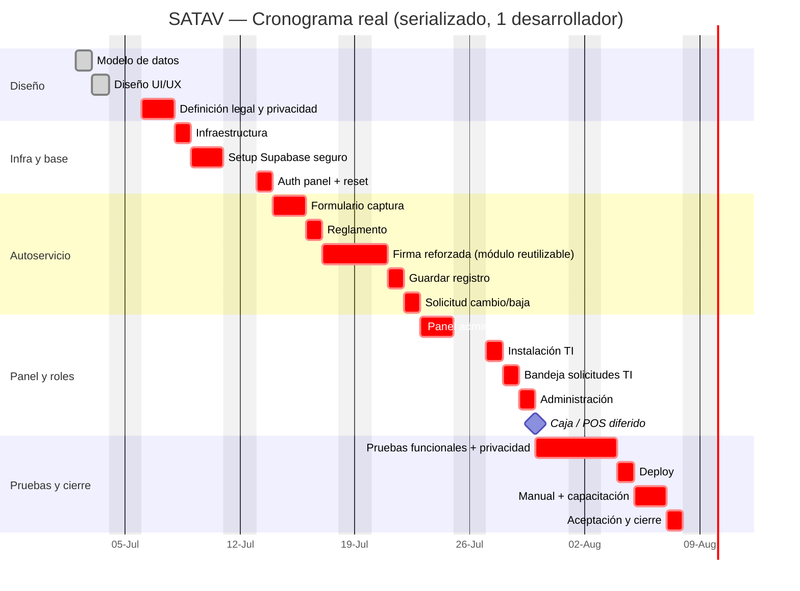

# SATAV — Sistema de Adquisición de TAG Vehicular

Alternativa web para reemplazar la hoja física de adquisición de TAG vehicular del
**Instituto Asunción de Querétaro AC (IAQ)**.

> **Portada del Plan de Dirección.** Este repositorio contiene la planeación completa del proyecto
> (metodología basada en PMBOK) y, más adelante, el producto.

| | |
|---|---|
| **Cliente** | Instituto Asunción de Querétaro AC (IAQ) — proyecto interno |
| **Responsable / Desarrollador** | Gerardo Sánchez — Soporte TI Jr. |
| **Aprobador / Auditor** | Miguel Ángel González Pacheco — Encargado de Sistemas Computacionales |
| **Estado** | 🟢 **En desarrollo** — prototipo UI listo; investigación legal y matriz de cumplimiento incorporadas |
| **Cierre estimado** | ~03-ago-2026 (opción A: cumplimiento legal mínimo para MVP; ≈ 22.5 días-persona) |

---

## Resumen ejecutivo

Sistema web que digitaliza el **reglamento del estacionamiento (22 cláusulas)**, la **captura de
datos** del usuario y su vehículo, la **aceptación con firma manuscrita digital**, y el **expediente**
de cada TAG a lo largo de su ciclo de vida, más un **panel administrativo**.

**Proceso en 3 momentos:**
1. **Usuario (autoservicio):** captura sus datos y **firma** el reglamento → registro *pendiente*.
2. **Administración:** asigna el **estacionamiento** y cobra el **TAG ($100, efectivo)**.
3. **Departamento de TI:** al instalar, captura el **No. de Dispositivo** → registro *instalado*.

**Fuera de alcance:** integración con hardware de acceso (lector/pluma), pago en línea, app nativa.

**Arquitectura (reutiliza la base de un sistema interno previo):** front **estático** (Next.js export)
+ **Supabase** (datos, con RLS) + **GoDaddy/Cloudflare** (hosting/DNS) + **GitHub Actions** (despliegue).

---

## Cronograma de ejecución

Plan diario de trabajo para el desarrollo serializado con **1 desarrollador**. Inicio: **02-jul-2026**.
Cierre estimado: **~03-ago-2026** (incluye las actividades nuevas de la junta 03-jul + controles legales mínimos
derivados de la investigación legal; sin esos cambios, 28-jul).
El detalle completo vive en [Alcance, WBS y Cronograma](Plan%20de%20Direccion/02%20-%20Alcance%2C%20WBS%20y%20Cronograma.md);
los cambios quedan registrados en la **[bitácora de cambios](Plan%20de%20Direccion/04%20-%20Bitacora%20de%20Cambios%20y%20Cierre.md)** (CC-01…CC-14).



> **Actividades nuevas (junta 03-jul):** las tres marcadas **(nueva)** —
> *Solicitud cambio/baja* y *Bandeja solicitudes TI* suman ~1 día sobre el plan base.
> *Caja / POS (MVP)* queda diferido mientras Administración no solicite folio, recibo o corte específico.
> (antes del ajuste legal habrían movido el cierre de 28-jul a ~30-jul). Los demás cambios de la junta (TAG propio se cobra, catálogo de modelo,
> etiqueta "Padre / Madre / Tutor", firma como módulo reutilizable, "de usted") van **dentro** de
> tareas ya existentes; su desglose por horas está en
> [Plan/02 §2.5](Plan%20de%20Direccion/02%20-%20Alcance%2C%20WBS%20y%20Cronograma.md).
>
> **Ajuste legal (opción A, 03-jul):** la investigación legal agrega controles mínimos para producción:
> aviso específico SATAV, aviso simplificado, firma reforzada con hash/versionado, tutor obligatorio
> para menores, RLS/RPC/Storage privado/MFA y pruebas de privacidad. NOM-151 queda como mejora de fase 2.
> Esto suma ~2 días-persona adicionales y mueve el cierre objetivo a **~03-ago-2026**.
>
> **Cómo marcar avance en el Gantt:** cambia la etiqueta de cada tarea de `:crit,` (pendiente, en
> **rojo**) a `:done,` (terminada, en **gris**) — o `:active,` para la que estés trabajando.
> *(Ejemplo: `Modelo de datos :done, a1, 2026-07-02, 1d`.)*

---

## Avance del desarrollo

> 📋 **Bitácora de control de cambios:** [Doc 4](Plan%20de%20Direccion/04%20-%20Bitacora%20de%20Cambios%20y%20Cierre.md) ·
> **[Sheet en línea](https://docs.google.com/spreadsheets/d/18fdAJkWnAMJOCGTiu-f8GH8XV_JuZzC4/edit)** ·
> [.xlsx](Plan%20de%20Direccion/bitacora-cambios.xlsx) — cambios de la junta 03-jul: **CC-01…CC-08**;
> ajustes legales opción A: **CC-09…CC-14**.

### Entregables y estado

Leyenda: ✅ Listo · 🟡 Listo, **pendiente de aprobación/definición** · 🔵 Borrador para decidir · ⚪ Pendiente

| Entregable | Estado | Revisar |
|---|---|---|
| **Modelo de datos + BD** (E1) | 🟡 1.er corte listo | [Doc modelo](Desarrollo/01%20-%20Modelo%20de%20Datos%20y%20Base%20de%20Datos.md) · [schema.sql](supabase/schema.sql) · [seed.sql](supabase/seed.sql) · [supabase/README](supabase/README.md) |
| **Modelo de dominio (POO)** | ✅ Listo | [Doc POO](Desarrollo/02%20-%20Modelo%20de%20Dominio%20POO.md) |
| **Prototipo UI/UX** (autoservicio + panel Admin/TI) | 🟡 Listo (datos *mock*) | **En línea:** [Inicio](https://satav.vercel.app/) · [Registro](https://satav.vercel.app/registro/) · [Panel Admin/TI](https://satav.vercel.app/admin/) *(acceso demo: cualquier correo/contraseña)* |
| **Investigación legal y matriz de cumplimiento** | ✅ Listo | [Doc investigación legal](Investigacion/02%20-%20Investigacion%20Legal%20SATAV.md) · [PDF](Investigacion/02%20-%20Investigacion%20Legal%20SATAV.pdf) |
| **Firma electrónica — mecánica y valor legal** | 🔵 Borrador para decidir con dirección/legal | [Doc firma](Desarrollo/06%20-%20Firma%20Electronica%20%28mecanica%20y%20valor%20legal%29.md) |
| **Arquitectura técnica** | ⚪ Pendiente | [Doc](Desarrollo/03%20-%20Arquitectura%20Tecnica.md) |
| **Seguridad, RLS y privacidad** | 🟡 Primer corte implementable, pendiente de aprobación | [Doc](Desarrollo/04%20-%20Seguridad%2C%20RLS%20y%20Privacidad.md) · [Aviso SATAV](Entregables/E6%20-%20Cumplimiento%20Legal%20y%20Privacidad/E6%20-%20Aviso%20de%20Privacidad%20SATAV.md) · [Checklist](Entregables/E6%20-%20Cumplimiento%20Legal%20y%20Privacidad/E6%20-%20Checklist%20Legal%20y%20Privacidad%20SATAV.md) |
| **Flujos del sistema** | ⚪ Pendiente | [Doc](Desarrollo/05%20-%20Flujos%20del%20Sistema.md) |

### Seguimiento del cronograma

> Marca `[x]` conforme avances. **Est.** = días estimados (tₑ). 🟡 = front-end prototipado, falta conectarlo a Supabase.
> Los ítems **🆕** vienen de la junta de Dirección (03-jul); su desglose por horas (subactividades SA-01…18)
> está en [Plan/02 §2.5](Plan%20de%20Direccion/02%20-%20Alcance%2C%20WBS%20y%20Cronograma.md).

**Diseño**
- [x] Modelo de datos — *Est. 1 d* ✅
- [x] Diseño UI/UX — *Est. 1 d* ✅ (prototipo navegable)
- [x] Definición legal y privacidad — *Est. 1.5 d* · 🟡 borradores y criterios listos, falta aprobación Dirección/Legal
  - [x] Aviso específico SATAV / anexo al aviso general IAQ (CC-09)
  - [x] Aviso simplificado para formulario + texto de aceptación (CC-09)
  - [x] Tratamiento de menores: firma de padre/madre/tutor (CC-11)
  - [x] Política mínima de conservación y ARCO operativo (CC-13)

**Infraestructura y base**
- [ ] Infraestructura (subdominio + Cloudflare + GitHub Action) — *Est. 1 d*
- [ ] Setup Supabase seguro (aplicar esquema/RLS/RPC/Storage/MFA) — *Est. 1.5 d* · schema ya escrito
  - [ ] 🆕 `cat_modelos` + seed marcas/modelos · `modelo NOT NULL` (B4)
  - [ ] Cobro simple: pago en efectivo sin folio/recibo/corte por ahora
  - [ ] 🆕 `solicitudes` + RPC `crear_solicitud` (B6)
  - [ ] 🆕 Campos `tag_apartado` (B1) y `tipo_validado` (B5)
  - [ ] 🆕 Vista `v_registros_incompletos` (B2)
  - [ ] RLS por rol + RPC controlada para escrituras críticas (CC-12)
  - [ ] Bucket privado para firmas + URLs firmadas temporales (CC-12)
  - [ ] MFA obligatorio para cuentas administrativas (CC-12)
- [ ] Auth del panel — *Est. 0.5 d* · hoy login *mock*

**Autoservicio**
- [ ] Formulario de captura — *Est. 1.5 d* · 🟡 prototipo listo
  - [ ] 🆕 Dropdown dependiente marca→modelo + "Otro" (B4)
  - [ ] 🆕 Etiqueta "Padre / Madre / Tutor" en tipo de usuario (B5)
  - [ ] 🆕 Copy "de usted" (B7)
- [ ] Reglamento (22 cláusulas) — *Est. 0.5 d* · 🟡 UI lista, faltan cláusulas reales
- [ ] Firma manuscrita digital reforzada — *Est. 2 d* · 🟡 prototipo listo, falta Storage/evidencia
  - [ ] 🆕 Diseñar la firma como **módulo reutilizable** (`SignaturePad`+`Firma`+`FirmaService`, desacoplado) (B8)
  - [ ] Hash SHA-256 + versión de reglamento/aviso + sello de tiempo (CC-10)
  - [ ] Firmante gestionante/tutor cuando aplique (CC-11)
- [ ] Guardar registro + comprobante — *Est. 1 d* · 🟡 prototipo listo, falta RPC real
- [ ] 🆕 Solicitud de cambio/baja (autoservicio) — *Est. ~0.5 d* (B6)

**Panel y roles**
- [ ] Panel administrativo — *Est. 1.5 d* · 🟡 prototipo listo
  - [ ] 🆕 Reporte de incompletos (registros con datos faltantes) (B2)
- [ ] Instalación (TI) — *Est. 1 d* · 🟡 prototipo listo
  - [ ] 🆕 Bandeja de solicitudes (atender cambio/baja → movimiento) — *Est. ~0.5 d* (B6)
- [ ] Administración (estacionamiento + pago) — *Est. 1 d* · 🟡 prototipo listo
  - [ ] 🆕 Cobrar también TAG propio + apartar TAG (B1)
  - [ ] 🆕 Validar tipo de usuario al cobrar (B5)
- [ ] Caja / POS (MVP) — diferido hasta que Administración solicite folio/recibo/corte específico (B3)

**Pruebas y cierre**
- [ ] Pruebas (funcional + privacidad/RLS + firma + ARCO) — *Est. 3 d*
- [ ] Deploy a producción (subdominio) — *Est. 0.5 d* · 🟡 prototipo en Vercel
- [ ] Manual + capacitación — *Est. 1.5 d*
- [ ] Aceptación + acta de cierre — *Est. 0.5 d*

**Avance:** **2 de ~22.5** días-persona terminados (~9 %). La junta de Dirección (03-jul) sumó
**≈ +2.4 días-persona** de alcance nuevo (Caja MVP + Solicitudes; el resto se absorbe en tareas existentes)
y la investigación legal suma **≈ +2 días-persona** de controles mínimos para producción (opción A:
aviso SATAV, firma reforzada, RLS/RPC/MFA, menores y ARCO básico). Con ese alcance el cierre serializado
pasa de **28-jul a ~03-ago-2026**. El **front-end** de Autoservicio y Panel (≈ 8.5 d) ya está
**prototipado**, por lo que parte del ajuste puede recuperarse durante la conexión a Supabase; no se
recomienda recortar pruebas de privacidad/RLS.

---

## Índice del Plan de Dirección

| # | Documento | Contenido |
|---|---|---|
| 0 | [Adecuación del Estándar](Plan%20de%20Direccion/00%20-%20Adecuacion%20del%20Estandar%20%28Caso%20IAQ%29.md) | Cómo se instancia el estándar en este proyecto |
| 1 | [Acta de Constitución e Interesados](Plan%20de%20Direccion/01%20-%20Acta%20de%20Constitucion%20e%20Interesados.md) | Charter (objetivos, alcance, riesgos) + interesados |
| 2 | [Alcance, WBS y Cronograma](Plan%20de%20Direccion/02%20-%20Alcance%2C%20WBS%20y%20Cronograma.md) | Alcance, WBS, modelo de datos y cronograma (PERT + ruta crítica + Gantt) |
| 3 | [Costos, Riesgos y RACI](Plan%20de%20Direccion/03%20-%20Costos%2C%20Riesgos%20y%20RACI.md) | Costos internos, matriz de riesgos, RACI y comunicaciones |
| 4 | [Bitácora de Cambios y Cierre](Plan%20de%20Direccion/04%20-%20Bitacora%20de%20Cambios%20y%20Cierre.md) | Plantillas para ejecución y cierre · **[bitácora en línea (Google Sheets)](https://docs.google.com/spreadsheets/d/18fdAJkWnAMJOCGTiu-f8GH8XV_JuZzC4/edit)** · [.xlsx](Plan%20de%20Direccion/bitacora-cambios.xlsx) |
| 5 | [Guía de Sesiones y Ruta Operativa](Plan%20de%20Direccion/05%20-%20Guia%20de%20Sesiones%20y%20Ruta%20Operativa.md) | Qué revisar al iniciar cada sesión, siguientes tareas y criterios ARCO/conservación |

**Investigación de soporte:** [Playbook técnico (reuso de SEVAD)](Investigacion/01%20-%20Playbook%20Tecnico%20%28reuso%20de%20SEVAD%29.md)

**Diseño técnico:** [Índice técnico](Desarrollo/00%20-%20Indice%20Tecnico.md)

---

## Estructura del repositorio

```
SATAV/
├─ Plan de Direccion/       Documentos de gestión (PMBOK) · img/ (diagramas)
├─ Investigacion/           Investigación de soporte (técnica, legal)
├─ Desarrollo/              Diseño técnico: datos/BD, dominio POO, arquitectura, seguridad, flujos, firma
├─ supabase/                Esquema SQL: schema.sql, seed.sql, RLS y RPC (1.er corte)
├─ app/ · components/ · lib/  Prototipo web (Next.js): autoservicio, panel Admin/TI, capa mock
├─ public/                  Imágenes institucionales (logo, escudo, monograma)
└─ Entregables/             Producto final, manuales exportados y entregas formales
```
