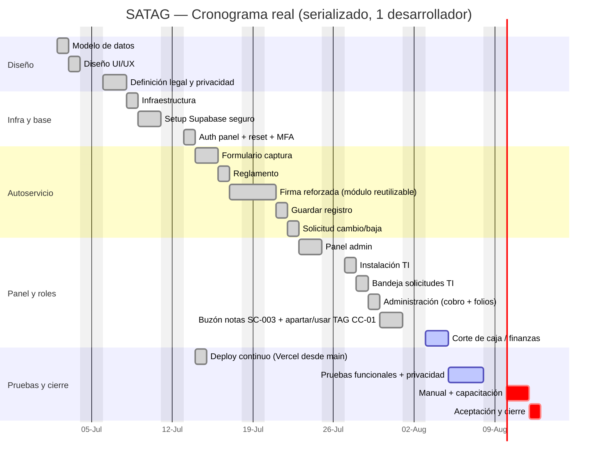

# SATAG — Sistema de Adquisición de TAG Vehicular

Alternativa web para reemplazar la hoja física de adquisición de TAG vehicular del
**Instituto Asunción de Querétaro AC (IAQ)**.

> **Portada del Plan de Dirección.** Este repositorio contiene la planeación completa del proyecto
> (metodología basada en PMBOK) y el producto, ya en producción.

| | |
|---|---|
| **Cliente** | Instituto Asunción de Querétaro AC (IAQ) — proyecto interno |
| **Responsable / Desarrollador** | Gerardo Sánchez — Soporte TI Jr. |
| **Aprobador / Auditor** | Miguel Ángel González Pacheco — Encargado de Sistemas Computacionales |
| **Estado** | 🟢 **En producción** — autoservicio, panel Admin/TI con roles finos y MFA, cobro con folios de recibo automáticos, apartar/usar TAG y buzón de notas ya operan sobre Supabase real (bloques SQL `00`→`41`). Pendiente activo: corte de caja / finanzas |
| **Cierre estimado** | ~03-ago-2026 (opción A). El núcleo ya opera en producción antes de esa fecha; resta la feature de finanzas, las pruebas finales, el manual y la aprobación institucional del aviso |

---

## Resumen ejecutivo

Sistema web que digitaliza el **reglamento del estacionamiento (22 cláusulas)**, la **captura de
datos** del usuario y su vehículo, la **aceptación con firma manuscrita digital**, y el **expediente**
de cada TAG a lo largo de su ciclo de vida, más un **panel administrativo**.

**Proceso en 3 momentos:**
1. **Usuario (autoservicio):** captura sus datos y **firma** el reglamento → registro *pendiente*.
2. **Administración:** cobra el **TAG ($100, efectivo)**.
3. **Departamento de TI:** con la persona presente, asigna el **estacionamiento** y captura el **No. de Dispositivo** al instalar → registro *activo*.

**Fuera de alcance:** integración con hardware de acceso (lector/pluma), pago en línea, app nativa.

**Arquitectura (reutiliza la base de un sistema interno previo):** front **estático** (Next.js 16 export)
+ **Supabase** (Postgres con RLS, Auth con MFA, Storage, RPCs `SECURITY DEFINER`) + **Vercel**
(hosting y despliegue automático: cada push a `main` publica en producción).

---

## Cronograma de ejecución

Plan diario de trabajo para el desarrollo serializado con **1 desarrollador**. Inicio: **02-jul-2026**.
Cierre estimado: **~03-ago-2026** (incluye las actividades nuevas de la junta 03-jul + controles legales mínimos
derivados de la investigación legal; sin esos cambios, 28-jul).
El detalle completo vive en [Alcance, WBS y Cronograma](Plan%20de%20Direccion/02%20-%20Alcance%2C%20WBS%20y%20Cronograma.md);
los cambios quedan registrados en la **[bitácora de cambios](Plan%20de%20Direccion/04%20-%20Bitacora%20de%20Cambios%20y%20Cierre.md)** (CC-01…CC-14).



> **Estado a 20-jul-2026:** el núcleo del cronograma ya está **en producción** (diseño, infra, Supabase
> seguro con roles/MFA, autoservicio, panel Admin/TI, cobro con folios, buzón SC-003 y apartar/usar TAG).
> El bloque base de fechas se conserva como línea base de planeación; el avance real vive en el checklist
> de abajo y en la [Guía de Sesiones](Plan%20de%20Direccion/05%20-%20Guia%20de%20Sesiones%20y%20Ruta%20Operativa.md). Pendiente activo: **corte de caja / finanzas**.
>
> **Actividades nuevas (junta 03-jul):** las tres marcadas **(nueva)** —
> *Solicitud cambio/baja* y *Bandeja solicitudes TI* suman ~1 día sobre el plan base.
> *Caja / POS (MVP):* los folios de recibo automáticos ya se implementaron (bloque 32); lo que queda diferido y en curso es el **corte de caja / finanzas**.
> (antes del ajuste legal habrían movido el cierre de 28-jul a ~30-jul). Los demás cambios de la junta (TAG propio se cobra, catálogo de modelo,
> etiqueta "Padre / Madre / Tutor", firma como módulo reutilizable, "de usted") van **dentro** de
> tareas ya existentes; su desglose por horas está en
> [Plan/02 §2.5](Plan%20de%20Direccion/02%20-%20Alcance%2C%20WBS%20y%20Cronograma.md).
>
> **Ajuste legal (opción A, 03-jul):** la investigación legal agrega controles mínimos para producción:
> aviso específico SATAG, aviso simplificado, firma reforzada con hash/versionado, tutor obligatorio
> para menores, RLS/RPC/Storage privado/MFA y pruebas de privacidad. NOM-151 queda como mejora de fase 2.
> Esto suma ~2 días-persona adicionales y mueve el cierre objetivo a **~03-ago-2026**.
>
> **Cómo marcar avance en el Gantt:** cambia la etiqueta de cada tarea de `:crit,` (pendiente, en
> **rojo**) a `:done,` (terminada, en **gris**) — o `:active,` para la que estés trabajando.
> *(Ejemplo: `Modelo de datos :done, a1, 2026-07-02, 1d`.)*

---

## Avance del desarrollo

> 📋 **Bitácora de control de cambios:** [Doc 4](Plan%20de%20Direccion/04%20-%20Bitacora%20de%20Cambios%20y%20Cierre.md) ·
> **[Sheet en línea](https://docs.google.com/spreadsheets/d/18fdAJkWnAMJOCGTiu-f8GH8XV_JuZzC4/edit)** ·
> [.xlsx](Plan%20de%20Direccion/bitacora-cambios.xlsx) — cambios de la junta 03-jul: **CC-01…CC-08**;
> ajustes legales opción A: **CC-09…CC-14**.

### Entregables y estado

Leyenda: ✅ Listo · 🟡 Listo, **pendiente de aprobación/definición** · 🔵 Borrador para decidir · ⚪ Pendiente

| Entregable | Estado | Revisar |
|---|---|---|
| **Modelo de datos + BD** (E1) | ✅ En producción (bloques SQL `00`→`41`) | [Doc modelo](Desarrollo/01%20-%20Modelo%20de%20Datos%20y%20Base%20de%20Datos.md) · [runbook `sql/`](supabase/sql/README.md) · [AUDITORIA](supabase/sql/AUDITORIA.md) · [supabase/README](supabase/README.md) |
| **Modelo de dominio (POO)** | ✅ Listo | [Doc POO](Desarrollo/02%20-%20Modelo%20de%20Dominio%20POO.md) |
| **UI/UX** (autoservicio + panel Admin/TI) | ✅ En producción sobre Supabase real | **En línea:** [Inicio](https://satag.vercel.app/) · [Registro](https://satag.vercel.app/registro/) · [Buzón](https://satag.vercel.app/solicitudes/) · [Panel Admin/TI](https://satag.vercel.app/admin/) *(credenciales reales de Supabase Auth + MFA)* |
| **Investigación legal y matriz de cumplimiento** | ✅ Listo | [Doc investigación legal](Investigacion/02%20-%20Investigacion%20Legal%20SATAG.md) · [PDF](Investigacion/02%20-%20Investigacion%20Legal%20SATAG.pdf) |
| **Firma electrónica — mecánica y valor legal** | ✅ Implementada (opción B: simple reforzada) | [Doc firma](Desarrollo/06%20-%20Firma%20Electronica%20%28mecanica%20y%20valor%20legal%29.md) |
| **Arquitectura técnica** | ✅ En producción (Next 16 + Supabase + Vercel) | [Doc](Desarrollo/03%20-%20Arquitectura%20Tecnica.md) |
| **Seguridad, RLS y privacidad** | ✅ Implementada (roles finos + RLS `aal2` + MFA); aprobación institucional del aviso pendiente | [Doc](Desarrollo/04%20-%20Seguridad%2C%20RLS%20y%20Privacidad.md) · [Aviso SATAG](Entregables/E6%20-%20Cumplimiento%20Legal%20y%20Privacidad/E6%20-%20Aviso%20de%20Privacidad%20SATAG.md) · [Checklist](Entregables/E6%20-%20Cumplimiento%20Legal%20y%20Privacidad/E6%20-%20Checklist%20Legal%20y%20Privacidad%20SATAG.md) |
| **Flujos del sistema** | ✅ En producción | [Doc](Desarrollo/05%20-%20Flujos%20del%20Sistema.md) |

### Seguimiento del cronograma

> **Est.** = días estimados (tₑ) de la línea base. Las casillas reflejan el estado real a 20-jul-2026.
> Los ítems **🆕** vienen de la junta de Dirección (03-jul); su desglose por horas (subactividades SA-01…18)
> está en [Plan/02 §2.5](Plan%20de%20Direccion/02%20-%20Alcance%2C%20WBS%20y%20Cronograma.md).

**Diseño**
- [x] Modelo de datos — *Est. 1 d* ✅
- [x] Diseño UI/UX — *Est. 1 d* ✅ (prototipo navegable)
- [x] Definición legal y privacidad — *Est. 1.5 d* · 🟡 borradores y criterios listos, falta aprobación Dirección/Legal
  - [x] Aviso específico SATAG / anexo al aviso general IAQ (CC-09)
  - [x] Aviso simplificado para formulario + texto de aceptación (CC-09)
  - [x] Tratamiento de menores: firma de padre/madre/tutor (CC-11)
  - [x] Política mínima de conservación y ARCO operativo (CC-13)

**Infraestructura y base**
- [x] Infraestructura (hosting + despliegue) — *Est. 1 d* ✅ · **Vercel** con despliegue automático desde `main` (el plan original contemplaba subdominio + Cloudflare + GitHub Action; se adoptó Vercel)
- [x] Setup Supabase seguro (esquema/RLS/RPC/Storage/MFA) — *Est. 1.5 d* ✅ · bloques `00`→`41` aplicados en producción
  - [x] 🆕 `cat_modelos` + seed marcas/modelos · `modelo NOT NULL` (B4)
  - [x] Cobro en efectivo **con folio de recibo automático** (`SATAG-AAAA-######`, bloque 32); el corte de caja sigue pendiente
  - [x] 🆕 `solicitudes` + RPC `crear_solicitud` (B6)
  - [x] 🆕 Campos `tag_apartado` (B1) y `tipo_validado` (B5) en el esquema
  - [ ] 🆕 Vista `v_registros_incompletos` (B2) — *no implementada*
  - [x] RLS por rol + RPC controlada para escrituras críticas (CC-12)
  - [x] Bucket privado para firmas (CC-12) · las URLs firmadas temporales se emitirán cuando el panel muestre la firma (hoy no la consulta)
  - [x] MFA obligatorio para cuentas administrativas (CC-12)
- [x] Auth del panel + reset de contraseña — *Est. 0.5 d* ✅ · login real con Supabase Auth (correo/contraseña), sesión persistente, recuperación por correo (`/admin/reset-password`) e invitación (`/admin/invite`) — ver [supabase/README](supabase/README.md#auth-del-panel-administrativo)

**Autoservicio**
- [x] Formulario de captura — *Est. 1.5 d* ✅
  - [x] 🆕 Dropdown dependiente marca→modelo + "Otro" (B4)
  - [x] 🆕 Etiqueta "Padre / Madre / Tutor" en tipo de usuario (B5)
  - [x] 🆕 Copy "de usted" (B7)
- [x] Reglamento (22 cláusulas) — *Est. 0.5 d* ✅ · texto oficial IAQ publicado (bloque 23)
- [x] Firma manuscrita digital reforzada — *Est. 2 d* ✅ · PNG en bucket privado + trazos + evidencia
  - [ ] 🆕 Extraer la firma a **módulo reutilizable** independiente (`lib/firma/`) (B8) — funciona en `components/SignaturePad.tsx` + `lib/supabase/api.ts`; aún no extraída a su propio paquete
  - [x] Hash SHA-256 + versión de reglamento/aviso + sello de tiempo (CC-10)
  - [x] Firmante gestionante/tutor cuando aplique (CC-11)
- [x] Guardar registro + comprobante — *Est. 1 d* ✅ · RPC `crear_registro` (bloque 19)
- [x] 🆕 Solicitud de cambio/baja (autoservicio) — *Est. ~0.5 d* ✅ (B6)

**Panel y roles**
- [x] Panel administrativo — *Est. 1.5 d* ✅ · con roles finos (admin/ti/consulta/super) y MFA
  - [ ] 🆕 Reporte de incompletos (registros con datos faltantes) (B2) — *no implementado*
- [x] Instalación (TI) — *Est. 1 d* ✅
  - [x] 🆕 Bandeja de solicitudes (atender cambio/baja → movimiento) — *Est. ~0.5 d* ✅ (B6)
- [x] Administración (registro de pago) — *Est. 1 d* ✅ · conexión real probada
  - [x] 🆕 Cobrar también TAG propio + apartar TAG (B1) — CC-01 completo (apartar + usar el TAG apartado)
  - [ ] 🆕 Validar tipo de usuario al cobrar (B5) — campos `tipo_validado*` en el esquema; la validación en el cobro aún no se conecta
- [ ] Caja / POS — folios de recibo ✅ (bloque 32); **corte de caja / finanzas** = siguiente feature en curso (B3)
- [x] 🆕 Buzón de notas sin folio (SC-003) — ✅ (bloques 34-41; público `/solicitudes` + vinculación/corroboración de TI)

**Pruebas y cierre**
- [ ] Pruebas (funcional + privacidad/RLS + firma + ARCO) — *Est. 3 d* · en curso (banco de QA `seed_tests_dev.sql`)
- [x] Deploy a producción — *Est. 0.5 d* ✅ · Vercel desde `main` (despliegue continuo)
- [ ] Manual + capacitación — *Est. 1.5 d*
- [ ] Aceptación + acta de cierre — *Est. 0.5 d*

**Avance:** el **núcleo del sistema está en producción** — autoservicio, panel Admin/TI con roles finos y
MFA, cobro con folios, buzón SC-003 y apartar/usar TAG (bloques SQL `00`→`41`). **Pendiente activo:
corte de caja / finanzas.** Quedan además las pruebas formales de cierre, el manual/capacitación, la
aceptación y la aprobación institucional del aviso de privacidad. El alcance real superó la línea base
de ~22.5 días-persona por las features añadidas después de la junta (SC-003, folios automáticos,
apartar/usar TAG, endurecimiento de roles finos + MFA); el cierre objetivo sigue en **~03-ago-2026**.

---

## Índice del Plan de Dirección

| # | Documento | Contenido |
|---|---|---|
| 0 | [Adecuación del Estándar](Plan%20de%20Direccion/00%20-%20Adecuacion%20del%20Estandar%20%28Caso%20IAQ%29.md) | Cómo se instancia el estándar en este proyecto |
| 1 | [Acta de Constitución e Interesados](Plan%20de%20Direccion/01%20-%20Acta%20de%20Constitucion%20e%20Interesados.md) | Charter (objetivos, alcance, riesgos) + interesados |
| 2 | [Alcance, WBS y Cronograma](Plan%20de%20Direccion/02%20-%20Alcance%2C%20WBS%20y%20Cronograma.md) | Alcance, WBS, modelo de datos y cronograma (PERT + ruta crítica + Gantt) |
| 3 | [Costos, Riesgos y RACI](Plan%20de%20Direccion/03%20-%20Costos%2C%20Riesgos%20y%20RACI.md) | Costos internos, matriz de riesgos, RACI y comunicaciones |
| 4 | [Bitácora de Cambios y Cierre](Plan%20de%20Direccion/04%20-%20Bitacora%20de%20Cambios%20y%20Cierre.md) | Plantillas para ejecución y cierre · **[bitácora en línea (Google Sheets)](https://docs.google.com/spreadsheets/d/18fdAJkWnAMJOCGTiu-f8GH8XV_JuZzC4/edit)** · [.xlsx](Plan%20de%20Direccion/bitacora-cambios.xlsx) |
| 5 | [Guía de Sesiones y Ruta Operativa](Plan%20de%20Direccion/05%20-%20Guia%20de%20Sesiones%20y%20Ruta%20Operativa.md) | Qué revisar al iniciar cada sesión, siguientes tareas y criterios ARCO/conservación |

**Investigación de soporte:** [Playbook técnico (reuso de SEVAD)](Investigacion/01%20-%20Playbook%20Tecnico%20%28reuso%20de%20SEVAD%29.md)

**Diseño técnico:** [Índice técnico](Desarrollo/00%20-%20Indice%20Tecnico.md)

---

## Estructura del repositorio

```
SATAG/
├─ Plan de Direccion/       Documentos de gestión (PMBOK) · img/ (diagramas)
├─ Investigacion/           Investigación de soporte (técnica, legal)
├─ Desarrollo/              Diseño técnico: datos/BD, dominio POO, arquitectura, seguridad, flujos, firma, MFA
├─ supabase/                Esquema SQL: bloques atómicos sql/00→41 (fuente de verdad); schema.sql/seed.sql como respaldo histórico
├─ app/ · components/ · lib/  App web (Next.js): autoservicio, buzón, panel Admin/TI; cliente Supabase en lib/supabase
├─ public/                  Imágenes institucionales (logo, escudo, monograma)
└─ Entregables/             Producto final, manuales exportados y entregas formales
```
